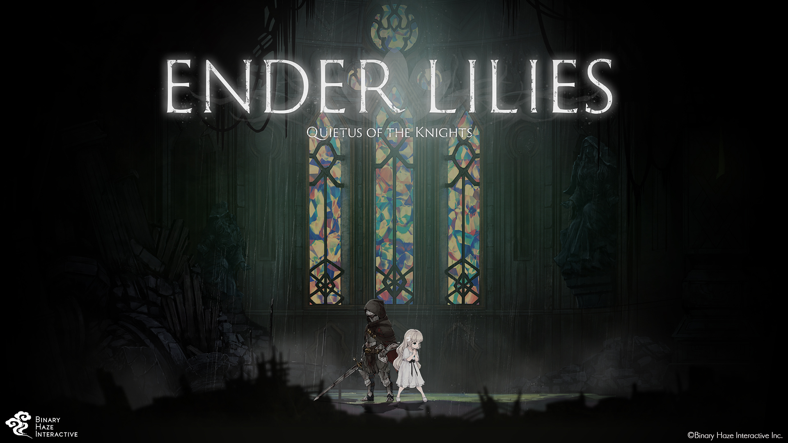
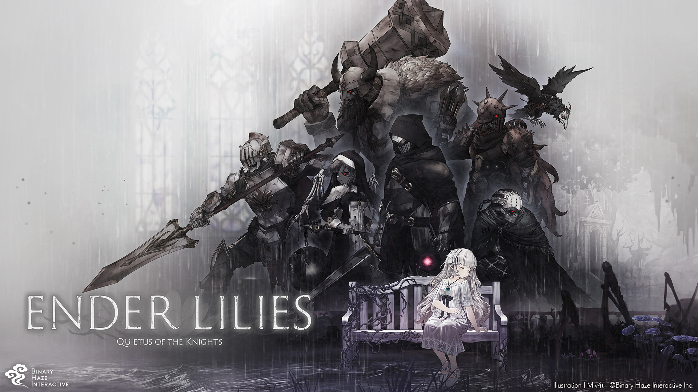

## 概要

<!-- table -->

|プレイ情報|
|---|---|
| タイトル | [Ender Lilies: Quietus of the Knights](https://en.enderlilies.com/) |
| 会社 | Binary Haze Interactive Inc. |
| 発売 | 2021 |
| プレイ時期 | 2023.01.01 ~ 2023.01.04 |
| 総プレイ時間 | 19h36m |

|個人的スコア|
|---|---|
| 総合スコア | 9.0/10.0 |
| 中毒度 | 8.0/10.0 |
| 息の長さ | 1.0/10.0 |
| 雰囲気 | 10.0/10.0 |

## 感想

俗に言う[メトロイドヴァニラ](https://ja.wikipedia.org/wiki/%E3%83%A1%E3%83%88%E3%83%AD%E3%82%A4%E3%83%89%E3%83%B4%E3%82%A1%E3%83%8B%E3%82%A2)系の2Dアクションゲーム。
細かく分割された小さな2Dマップがクモの巣状に繋がるように構成されている。初期状態では基本的な移動しか出来ず、ストーリーを進めてアクションスキルを獲得すると行けるマップが増えていく。その性質上、新たに得たスキルで行けるようになった場所を探すために同じマップを何度も往復する。

ストーリーは、マップ上に散らばっている書籍的なものと、ボス戦で得られる小さな回想の集積のみだが、十分に全体像を理解し、その上で想像を働かせることができるようになっている。全体的にデストピア感漂う雰囲気であり、マップも基本的には薄暗いフィールドでいかつい見た目の敵キャラが登場してくる。一方で、主人公の白巫女であるリリィは対象的な見た目をしており、黒と白のコントラストが良い味を出している。

### マップが完璧

まず第一にマップが素晴らしい。

メトロイドチックなゲームをやったの初めてだから他がどうなってるかは知らんけど、メトロイドヴァニアのWikipediaに書いてある良いポイントがちゃんと良いポイントになっている。
最初は回避とジャンプしか出来ないため行けるところは限られているが、ボスを倒してアクションスキルを身につけると徐々に行けるところが増えてくる。そのため、ボスを倒して新しいスキルを身につけては、これまでに訪れたマップに再び赴き新しいスキルが使える場所を探すことになる。最初に来たときにはどう頑張っても辿り着けなかった場所が、新しいスキルによって行けるようになり新たな世界が見えてくる体験というのは、このゲームの最も良いポイントの1つ。それでいて、マップによっては実は必要なのは新しいスキルではなくプレイヤースキルであるというような場合もあり、行けそうで行けない場所には10分以上時間を費やしてしまったりする。

マップのサイズもこの上なく適切で、最終的に見返してみる圧巻の多さではあるが、プレイ時間的には必要十分な量になっている。

### ノンストレスな死にゲー

基本的に、このゲームは何度も死んではリトライすることを前提に作られている(多分、知らんけど)。それは探索においてもボス戦においても当てはまる。

リリィはHPを一定量回復することのできるアクションを3~5回程度行うことができるが、死ぬまでの探索時間の上限はおおよそこの回復回数で定められている。死ぬとレストポイントと呼ばれるセーブ地点からやり直しになる。レストポイントでは体力やスキルポイント等が全回復する一方、これまで倒した敵が元通りになる。また、レストポイント間はファストトラベルすることができる。よって、探索中に命が付きそうになった場合には、とにかく敵の攻撃を避け続けて未発見のレストポイントを探そうと躍起になること必至。但し、このレストポイントの設置感覚がかなり絶妙で、例え途中で死んでも大きく戻されることなくプレイを再開することができる。
また、マップ上には2度目以降の探索のストレスを減らすためのショートカット的なものも用意されている。

ボス戦は、何体かを除いて初見でクリアするのはかなりきつい。多い奴だと50回程度のリトライでやっとクリアできた。しかし、大ボス戦の直前には必ずレストポイントがあり、且つボス演出も全てスキップできるため、再戦にストレスはない。敵の行動パターンを1つずつ理解し、それに対する回避の最適解と攻撃の隙をリトライのたびに少しずつ理解していくのが楽しい。リリィには、攻撃スキルと装備アイテムをそれぞれ20~30程度の中から複数選択して装備できるため、各ボス(少しだけ探索にも影響)に対して有効なスキルやアイテムをトライアンドエラーで試していくという楽しさもある。

また、デスペナルティが一切ない。敵を倒すごとに"穢れ"と呼ばれる経験値を入手でき、これが貯まるとレベルアップするのだが、死んでもこの経験値やレベルは消えない。また、入手アイテムや発見したマップも死ぬ前の状態が引き継がれる。よって、死ぬことにより戻るのは今いる場所だけということになる。死んでもそれまでのプレイが無駄になる可能性がまったくないというのは、プレイ中の心理的安全性を大いに確保してくれる。

### 丁度よいボリュームと難易度

総プレイ時間は20時間弱だった。これは、いくつか存在するエンディング全てをクリアし、且つアイテム等の全入手やレベル100等のトロフィー全てを獲得するのに有した時間である。

レベル上げは、とりわけ意識的には行わずストーリー全クリアの段階で90少しだった。そこから100までに20分ほどしかかからなかった。また、アイテムの全入手に関しても、探索中に意識的に行うようにしていたためストーリークリアの段階で残りは10程度になっていた。だらだらと単調なレベル上げやアイテム回収をさせないながらも、満足感のあって丁度いいことこの上ないボリュームになっている。一応クリア後にはエンドコンテンツもあるが、それはやっていない。

難易度は確か3つ選べた内のNORMALを選択したが、これも丁度いいことこの上なし。探索では上手く敵を裁けないと容易に死ぬし、ボス戦も決して1,2回では倒せない(感覚だと、平均で8リトライくらい)が、上述した工夫のおかげでストレスなく進めていくことが出来、気づくとクリアできる難易度。

最近は長時間ぶっ続けでプレイしちゃうようなゲームが苦手だけど、このゲームはいい感じに区切りをつけて中断できるので嬉しい。

### ダークっぽい、いい感じのグラフィックと音楽

グラフィックは、詳しくないから語彙力ないけど、良いです。基本的にキャラはデフォルメチックではあるが、それでいて全く安っぽい感じがせず、デストピア感のあるダークな世界観にマッチしている。敵キャラは、グロテスクなやつから、ゴツかったり格好良かったりなやつまで色々。基本的にみんな見た目怖くて泣いちゃうかと思ったけど、それがリリィとの良い対比になっている。

音楽に関してはまじで無知だけど、良いです。かっこいい。ボス戦で、悲しい(基本的にボスは悲しい背景を持っている)雰囲気なのに、音楽は何故か明るい曲調になっているようなバトルもあり、こういうのもエヴァみたいで良いよね、エヴァ知らんけど。

*本ページ中の画像・タイトル等は全て [Binary Haze Interactive Inc.](bhaze.com) の著作物です。*
