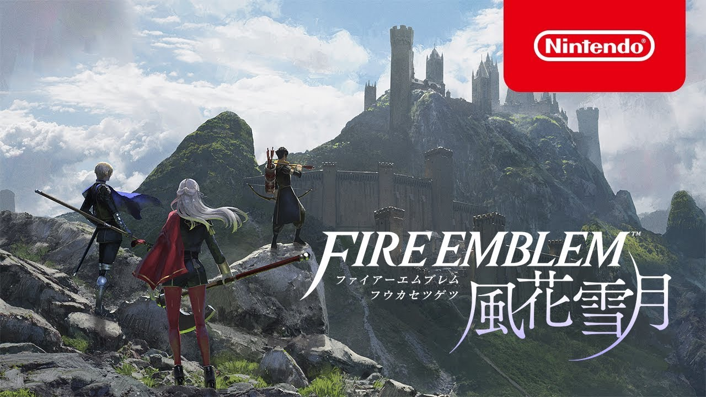

## 概要

<!-- table -->

|プレイ情報|
|---|---|
| タイトル | [ファイアーエムブレム 風花雪月](https://www.nintendo.co.jp/switch/anvya/pc/index.html) |
| 会社 | 任天堂 |
| 発売 | 2019 |
| プレイ時期 | 2021.11 ~ 2022.08 |
| 総プレイ時間 | 340h |

|個人的スコア|
|---|---|
| 総合スコア | 9.8/10.0  |
| 中毒度 | 10.0/10.0 |
| 息の長さ | 9.0/10.0 |
| 周回 | 9.0/10.0 |

## 感想

スマブラきっかけで、初めてプレイしたFEシリーズ。結果として、自分の中で最も好きなゲームの1つになった。

いわゆるマスゲー形式のSRPG。学園と戦争を舞台にしたストーリーで、フィールドでの育成パートと戦闘パートに分かれている。育成パートでは学園内を走り回ってキャラとの友好度を上げたりトレーニングをしたりする。戦闘パートではターン制でキャラを動かし相手を滅ぼせば勝ち。何よりもストーリーが良く、主人公以外の3人のメインキャラの思惑が錯綜する物語になっている。3人のメインキャラの内1人(厳密には、もう1分岐ある)を選んでストーリーを進めていく。

### ストーリーが素晴らしい

3+1人のメインキャラを選んでストーリーを進めていく。どれを選んでも基本となる粗筋は同じだが、

*本ページ中の画像・タイトル等は全て [Nintendo Co., Ltd](https://www.nintendo.co.jp/) の著作物です。*
