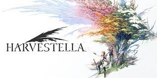

## 概要

|プレイ情報|
|---|---|
| タイトル | [HARVESTELLA](https://www.jp.square-enix.com/harvestella/) |
| 会社 | SQUARE ENIX |
| 発売 | 2022 |
| プレイ時期 | 2023.4.29 ~ 2023.05.20 |
| 総プレイ時間 | 60h |

|個人的スコア|
|---|---|
| 総合スコア | 9.2/10.0  |
| 音楽 | 13.9/10.0 |
| 戦闘 | 5.2/10.0 |
| ストーリー | 10.0/10.0 |
| 農業 | 8.0/10.0 |
| UI | 6.0/10.0 |
| サブクエスト | 9.0/10.0 |
| グラフィック | 9.0/10.0 |
| ボイス | 0/10.0 |

## イントロ

農業ゲーム+RPGの融合ゲー。

個人的にはスクエニのゲームには少し苦い思い出がある。
具体的には[オクトパストラベラー](https://www.jp.square-enix.com/octopathtraveler/)が全くハマらなくて開始2hで挫折したり、
[The DioField Chronicle](https://www.jp.square-enix.com/diofieldchronicle/)の終わり方に納得いかなかったり、
あと完全に趣味だがHD2Dというシステム自体が好きじゃないのにゴリ押ししていたりという理由から、
スクエニのゲームを買うのはずっと避けてきた。
とはいってもたまにどストライクのゲームがあるのも事実で、[BRAVELY DEFAULT 2](https://www.jp.square-enix.com/bd2/)なんかはゲームシステムもグラフィックも好きでかなりハマった記憶がある。

今回Harvestellaを購入したのは、たまたま農業系をやりたいと思っていた(そして[牧場物語 Welcome!ワンダフルライフ](https://www.bokumono.com/series/welcome/)を試してみて7分で飽きるという最速記録を叩き出した)というのと、
GWイベントでスクエニがセールをしており、スクエニにしてはいい値段の下げ方をしていたから(定価7680円に対してセール値3840円)。

### 音楽に始まり音楽に終わる一作

このゲームは、個人的にBOSEのヘッドホンを買ったということもありヘッドホンをしてプレイした(これまではイヤホン・ヘッドホンを使ってゲームをしたことはほとんどない)。
それによる贔屓も入っているかもしれないが、それを差し引いても音楽が素晴らしい。とてつもなく、良い。

正直これだけで、もとが取れるんじゃないかと思うくらい良い。
日常のゆったりとした音楽から、緊急事態の忙しない音楽、クライマックスの壮大な音楽に至るまで全ての音楽が素晴らしかった。
それから、会話送りでAボタンを押した時の音だとか決定ボタンを押したときの音ですら心地よかった。これは流石にヘッドホン補正が入ってるかもしれないけど。

メインコンポーサーは 椎名 豪 という人らしい。正直ゲームの音楽興味なかったので知らない人だけど。
次にゲームを買うときは音楽コンポーサーの名前を見てから買おうと思うくらいには良かった。

[サントラ](https://www.jp.square-enix.com/music/lineup/item/SQEX-50160.html)買おうかと思ってます。

### 農業要素は満足

農業ゲーム的なゲームをしたのは初めてだったが、日々のタスクを効率的にやりつつRPGを進めていくというのは面白かった。

農業は、四季のある村で季節や場所に応じた作物を育てていく感じ。
育てた作物の用途としては、売ってお金にするか、料理や加工に使って回復アイテムにするかがメインの択。
序盤はかなりお金がシビアで、種を買うにもお金がいいるのでかなりカツカツになる。
後半に行くにつれて(ただクリアするだけなら)お金に余裕が出てくるので、そこまで農業が必須というわけではなくなる。

農業では耕す・植える・水をやる・収穫するといったプロセスがあるが、
各プロセスはFairy Orderというサブミッションのようなものをクリアしていくとスキルやツールが得られ、
どんどん楽になっていくというシステム。
この効率化のペースも、おおよそちょうどよかったと思う。

金策としては農業をするよりもクエストをするほうが遥かに良いしクリアするだけならそれだけでも良いと思うが、
Fairy OrderやFood Deliveryや回復アイテムとしての要素を組み合わせることで、
いい感じに農業へのモチベーションを高めていた。
特に後半の戦闘はジュースでゴリ押すことも多かったため、果物や野菜の生産は必須だった。
また、作った料理の一枚絵も綺麗だったため、料理コンプへのモチベーションがいい感じに農業のモチベーションにつながっていた。

農業するときのアクションで、細かい不便な点はほんの少しあった(チャージすると向きを変えられない・チャージで耕すときに既に耕したマスを起点にしてチャージができない等)が、まあ全然許容範囲。

### 戦闘システムは、不便な点こそあるが許容範囲

戦闘はマップ上でのシームレスなエンカウント方式。
ジョブごとにスキルがあり、ジョブを切り替えつつ相手の弱点をついていくという感じ。

まぁ正直ボタンポチポチゲーではある。ガードはないので基本は避けるしか無い。
避けるにはダッシュ・ステップができるが、基本的に敵の当たり判定が意味不明なため、
敵の攻撃が当たらない遠隔から攻撃できるMageやLunamancerで戦っていた。

それから、敵の弱点を突くといっても敵の弱点が何かを示すアイコンが異常に小さくほとんど見えない。
それから自分のスキルの属性もよくわからないため、正直弱点を突こうという意識はほとんどなかった。

体力は料理で作った回復アイテムで回復できるが、満腹度がマックスになると食事ができなくなるため、
満足度を上昇させないジュースでの回復がメインになった。
最後の方はジュースを大量持参して体力減ったらX連打みたいな戦闘スタイルになっていた。

最も不満な点が、Double Breakしたときの必殺技みたいなやつ。
敵をBreakすると味方のムービー付きの必殺技を撃てるのだが、
なんとこのムービー中も時間が停止せず、敵は攻撃し続けるという代物。
しかもこっちはムービー中は操作不能なので、必殺技を打ってる間にボスに必ずやられてしまうという意味不明システム。
おかげでDouble Breakを終盤で使うことはほとんどなかった。

まぁでも戦闘自体はそこまで期待していなかったし、総合的に見るとそこまでひどいものでもなかったからよし。

### だんだん壮大になっていくストーリー / 丁寧なサブクエスト

ストーリーは結構好き。もちろん詳しくは書けないけど。

もちろん始まりから平和というわけではないけど、それでも比較的おっとりとした序盤から、
終盤に行くにつれてだんだんと壮大・抽象的になっていくストーリーはかなり良かった。
ちゃんと盛り上げるところを(音楽の力も借りて)盛り上げていて良い。
ちゃんと言ってほしいところでお決まりっぽいセリフを言ってくれるのも、安心感がある。

この作品の音楽についで良かった点は、サブクエストが丁寧な点。
もちろん本質的にはお使い的なことをやるのだが、キャラクターごとの掘り下げがしっかりとしていて、
ちゃんとサブクエごとに起承転結を作っているのが素晴らしい。
音楽の恩恵も十分に受けている。
Harvestellaの1個前にライザのアトリエ3をやっていたのだが、これのサブクエが本当にしんどかったため、
本作品はサブクエストが丁寧なのがとても嬉しかった。

### イラスト/マップは少し古い感もあるが個人的に好き

マップは箱庭型。基本的には壁を登るとか高い段差を登るみたいなことは出来ない。
マップ自体は普通に綺麗。Switchにしてはかなり良いグラフィックに感じた(あんまグラフィック詳しくないけど)。

主人公は決められたプリセットから選ぶ。髪色とか瞳の色とかだけ変えられた気がする。
自由度はないが、主人公のデザイン自体が好みだったため全く不満はなし。
登場人物のデザインはみんな好きだった。男女どっちも服のデザインも良かった。

ただし、ボイスは本当におまけ程度しか無い。本当に誰も喋らない。
家を出るときとか畑を出るときとかに妖精が少ししゃべるくらい。
おかげで、たまに誰かが喋ったとしても誰が喋ってるのか全く分からなかった。
せめてムービーシーンとかだけでもボイスが欲しかった。

### 終わりに

多少の不満点こそあるものの、尋常じゃなく素晴らしい音楽とよく練られたストーリー・サブクエに支えられて、かなり楽しめたゲームだった。デザイン・雰囲気・グラフィックもかなり自分の好みに刺さっていて、好きなゲームのトップ5に入る。

全然関係ないけど、Harvestellaはぼくがイタリアに行く必要があった時に唯一イタリアでプレイしたゲームなのでそれ込みで思い出に残る一作。
あとめちゃくちゃ関係ないけど、英語設定でやったのでいい感じに英語の勉強にもなった(地名とか全く読めなかったので、クリア後にググる時に困った)。

*本ページ中の画像・タイトル等は全て [Square Enix Holdings Co., Ltd](https://www.square-enix.com/) の著作物です。*
