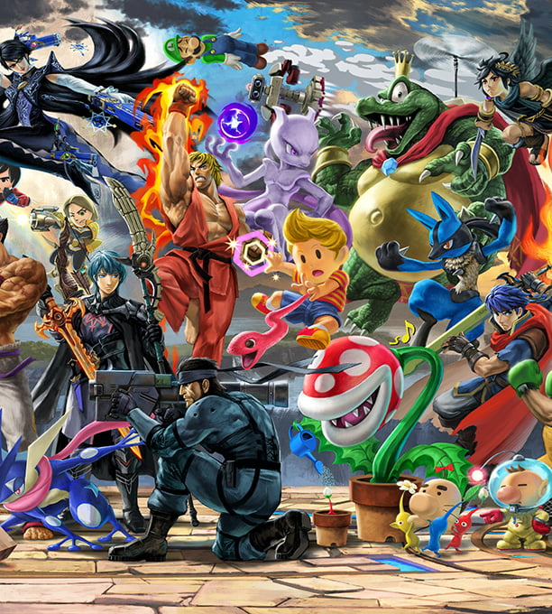

## 概要

|プレイ情報|
|---|---|
| タイトル | 大乱闘スマッシュブラザーズ SPECIAL |
| 会社 | 任天堂 |
| 発売 | 2018 |
| プレイ時期 | 2018.12.7 ~ |
| 総プレイ時間 | 1500h + |

|個人的スコア|
|---|---|
| 総合スコア | 10.0/10.0  |
| 中毒度 | 9.0/10.0 |
| 息の長さ | 10.0/10.0 |

## 感想

紛うことなき神ゲー。パーティゲーであり、格ゲーでもある。

スマブラはDXを親戚の家で少しやったところから始まり、Xに大いにドハマりした。当時はオンラインとかはやらずに兄弟が友達とひたすらプレイしていたため、メタナイトがぶっ壊れとかは全く知らなかった。forUは丁度受験期だったためやっておらず、SPの発売を待ち望んでいた。発売日から今日に至るまで、未だに同じ熱量でプレイし続けている。

### パーティゲーであり、ガチゲー

任天堂公式的にはパーティゲーとしての側面を推したがっている気がする。勿論パーティゲーとしてかなり優秀で、スマブラきっかけで話が深まったこともあるし、今のバイトはスマブラきっかけで始めたと言っても過言ではない。

しかしながら、スマブラの良いところはガチの格ゲーとしても遊べるところ。ゲームはやっぱり学習要素がないと長続きしない。その点スマブラは、上手い人のプレイ動画を見たり、沢山開催されている大会動画を見たり、ひたすらトレーニングモードで反復練習したりと、「腕を上げる」楽しみで溢れている。パーティゲーを推している一方で、VIP部屋という格ゲー勢にもちゃんと配慮し続けてくれている任天堂には感謝しかない。

今の持ちキャラは、ルフレ・マルス・カービィ・ルカリオ・ミュウツー・ドンキーです。ルカリオはそろそろクビにしようと思います。

### 他のゲームへの橋渡しにもなる

スマブラに登場するからという理由でプレイしてみたゲームが結構ある。ファイアーエムブレム風花雪月は最たる例で、スマブラに出てくるからなんとなく始めてみたら、自分の中で片手の指に入るくらい好きなゲームになった(再来週に迫ったエンゲージの発売が待ちきれない)。また、ペルソナ5もスマブラきっかけで初めて、PS4(P5)とSwitch(P5R)の両方でプレイした。ホムヒカ参戦後はゼノブレイド2もやった(マップの見にくさと、キャラがはまらなくて途中で断念したけど)。3が出たので3もやった(こっちは全クリした)。Miiのコスプレが出たときにはUndertaleもやったし、金銀以来やっていなかったポケモンも出てるしやっておくか〜ということで剣盾・アルセウス・SVをやった。サムスはメトロイド自体やっていないものの、メトロイドを調べているときにメトロイドヴァニアというジャンルを知り、それきっかけで[Ender Lilies](../enderlilies)をやった。

メーカーを問わず色んな会社が出てくれてすげ〜〜と思ってたけど、こうして参戦キャラのゲームをやるきっかけになっており、宣伝効果は絶大なんだと思う。

### 唯一の欠点は、次回作が不安

これ以上のゲーム、あり得るか？？？？？？？？

過去作全キャラ出てるし、有名IPから沢山参戦してるし、ゲームスピードもかなりスピーディでストレスないし、Xのメタ程のぶっ壊れは居ないし。桜井さんがこれで満足してしまって、次回作が出ないんじゃないかということだけが、唯一の不安。もう5年経ちますよ.......!

*本ページ中の画像・タイトル等は全て [Nintendo Co., Ltd](https://www.nintendo.co.jp/) の著作物です。*
