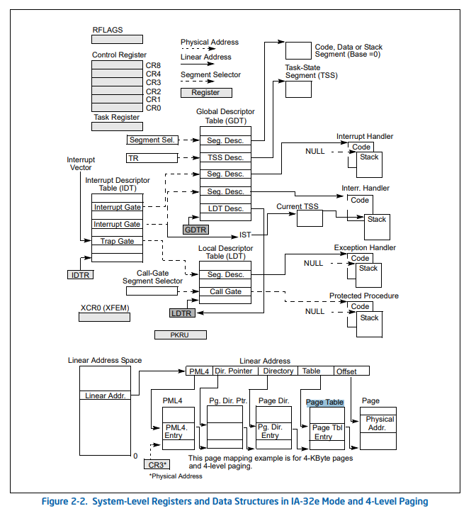
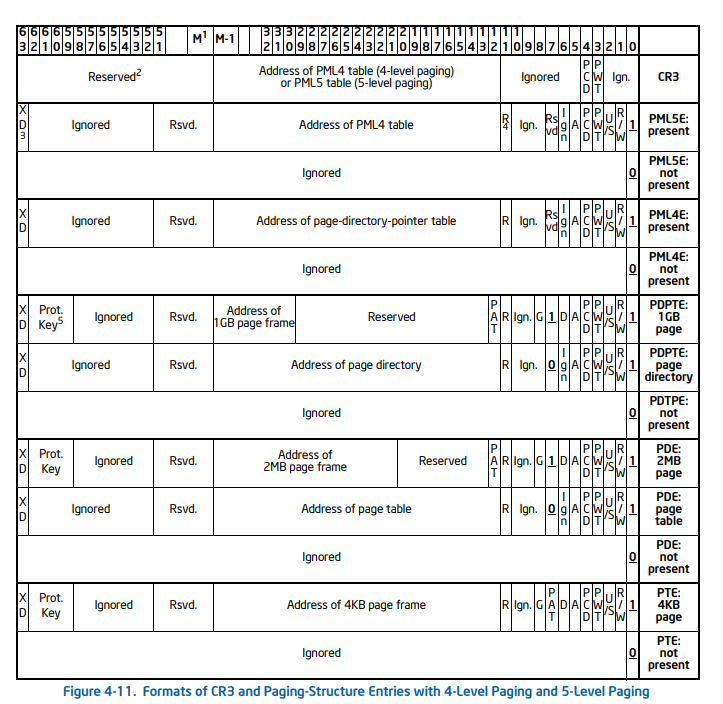
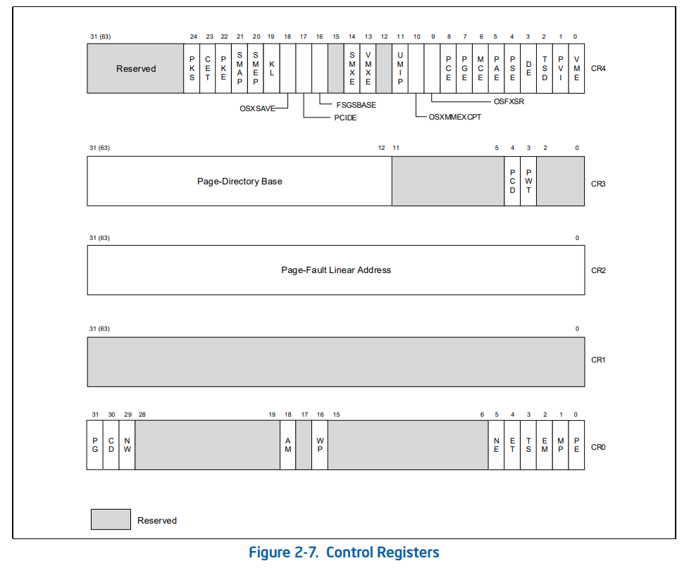

Linuxの4-level paging、何かと細かいところ忘れがちですよね。

## Pre-requisites

ページテーブルは上位から順に`PGD`,`PUD`,`PMD`,`PTE`と呼ぶこととする。また、各テーブルに含まれているエントリのことも同じ名称で呼ぶこととするが、特にテーブル・エントリのどちらかを明示したい場合には`PGD-table`/`PGD-entry`のように呼ぶこととする。
また、特に断りがない限りは4-level pagingに限定した話であり、5-level pagingは考えないものとする。

## 基本事項あれこれ

この図[^1]の下の部分が4-level pagingの概要。図中では`PML4`とか書かれているが、SDMとLinuxソースでは呼び方が異なるため[Prerequisites](#pre-requisites)で定義した呼び方で呼ぶ。



各テーブルのエントリが持つ値は、以下の感じ。図は5-levelも考慮されているが、4-levelの場合は`PML5E`のことは無視。



`PMD`の7th-bitが立っている場合は2MB page(`huge page`)として扱われ、PTEは存在せずに直接物理ページを指す。最近だと1GB pageもあるが、よく知らないしLinuxでサポートされてるかわからないので無視。

### ページテーブルのページサイズ

基本的にはどのテーブルも1ページ(4KiB)[^2]。

```c
// include/asm-generic/pgalloc.h
static inline pgtable_t __pte_alloc_one(struct mm_struct *mm, gfp_t gfp)
{
	struct page *pte;

	pte = alloc_page(gfp); // <-- 1ページ分確保
	if (!pte)
		return NULL;
	if (!pgtable_pte_page_ctor(pte)) {
		__free_page(pte);
		return NULL;
	}

	return pte;
}
```

但し、**KPTI**が有効になっている場合にはPGDはuser/kernel用にそれぞれ1Pの、合計2ページ確保される:

```c
#ifdef CONFIG_PAGE_TABLE_ISOLATION
#define PGD_ALLOCATION_ORDER 1
#else
#define PGD_ALLOCATION_ORDER 0
#endif
static inline pgd_t *_pgd_alloc(void)
{
	return (pgd_t *)__get_free_pages(GFP_PGTABLE_USER,
					 PGD_ALLOCATION_ORDER);
}
```

### プロセス間での共有

PTEはプロセス間で共有される。対して、PGDは各プロセスが独立して持つ。
具体的には、fork時に`init`プロセス[^3]のPGDをコピーして新しいプロセスのPGDを作成する:

```c
static struct mm_struct *mm_init(struct mm_struct *mm, struct task_struct *p,
	struct user_namespace *user_ns)
{
    ...
	if (mm_alloc_pgd(mm))
		goto fail_nopgd;
    ...
}
pgd_t *pgd_alloc(struct mm_struct *mm)
{
	pgd_t *pgd;
	pgd = _pgd_alloc();
    ...
	pgd_ctor(mm, pgd);
    ...
}
static void pgd_ctor(struct mm_struct *mm, pgd_t *pgd)
{
	if (CONFIG_PGTABLE_LEVELS == 2 ||
	    (CONFIG_PGTABLE_LEVELS == 3 && SHARED_KERNEL_PMD) ||
	    CONFIG_PGTABLE_LEVELS >= 4) {
		clone_pgd_range(pgd + KERNEL_PGD_BOUNDARY, // <-- ここ
				swapper_pg_dir + KERNEL_PGD_BOUNDARY,
				KERNEL_PGD_PTRS);
	}

	if (!SHARED_KERNEL_PMD) {
		pgd_set_mm(pgd, mm);
		pgd_list_add(pgd);
	}
}
```

ではPMUとPMDはどうなっているかというと、知りません。なんかコード中に`SHARED_KERNEL_PMD`とあるため、なんか設定できるのかもしれないけど、要検証。

## CR3とPGD

### CR3 register

各ページテーブルエントリは、後段のページテーブルの物理アドレスを持っている。よって、PGDのアドレスさえわかっていればそのプロセスに置いてVP変換ができる。このPGDのアドレスは、CR3レジスタが保持する:



VP変換はMMUが勝手にやってくれて、その際にCR3のアドレスを使ってやってくれる。

### CR3と`task_struct`

では各プロセスごとのPGDは誰が記憶しているかと言うと、`task_struct->mm->pgd`が保持している:

```c
struct mm_struct {
  struct {
    ...
    pgd_t * pgd; // <-- PGDへのアドレスを保持
    ...
  }
  ...
}
```

ここに入っているPGDの値はMMUが直接触るわけではなく、MMUはCR3の中に入っている値しか見ない。`mm->pgd`は、kernelのコードが後段のテーブルにアクセスするために利用される。

### Context Switchと`mm->pgd`

`mm->pgd`の値は、CR3に入らないとMMUからは見えない。`mm->pgd`からCR3への値の代入は、`context_switch()`から呼ばれる関数で行われている:

```c
void switch_mm_irqs_off(struct mm_struct *prev, struct mm_struct *next,
			struct task_struct *tsk)
{
    ...
	if (need_flush) {
		this_cpu_write(cpu_tlbstate.ctxs[new_asid].ctx_id, next->context.ctx_id);
		this_cpu_write(cpu_tlbstate.ctxs[new_asid].tlb_gen, next_tlb_gen);
		load_new_mm_cr3(next->pgd, new_asid, true);
		trace_tlb_flush(TLB_FLUSH_ON_TASK_SWITCH, TLB_FLUSH_ALL);
	} else {
		load_new_mm_cr3(next->pgd, new_asid, false);
		trace_tlb_flush(TLB_FLUSH_ON_TASK_SWITCH, 0);
	}
    ...
}
```

`xxx_tlb_flush()`系の関数によって、TLB上に残っている古い変換表をクリアしている。

## KernelとPGD

読者の方もやったことがあると思うが、`schedule_delayed_work()`等でkthread[^4]を作って、そのハンドラの中から`current->mm->pgd`のようにPGDテーブルを参照しようとすると、ヌルポになる。それもそのはずで、**kthreadは自身の`mm`を持っていない**。clone時に、他のプロセスから`mm`を奪って`task_struct->active_mm`に代入する:

```c
static int copy_mm(unsigned long clone_flags, struct task_struct *tsk)
{
	struct mm_struct *mm, *oldmm;

	tsk->min_flt = tsk->maj_flt = 0;
	tsk->nvcsw = tsk->nivcsw = 0;

	tsk->mm = NULL;
	tsk->active_mm = NULL;

	/*
	 * Are we cloning a kernel thread?
	 *
	 * We need to steal a active VM for that..
	 */
	oldmm = current->mm;
	if (!oldmm)
		return 0;

	/* initialize the new vmacache entries */
	vmacache_flush(tsk);

	if (clone_flags & CLONE_VM) {
		mmget(oldmm);
		mm = oldmm;
	} else {
		mm = dup_mm(tsk, current->mm);
		if (!mm)
			return -ENOMEM;
	}

	tsk->mm = mm;
	tsk->active_mm = mm;
	return 0;
}
```

## Misc

ページテーブル辿りたい時用のsnippet貼っておこ。`pxd_offset()`で得られるアドレスは、テーブル自体のアドレスではなく、テーブル内のエントリのアドレスだから、注意だYO!

```c
ulong pgd_addr = (ulong)mm->pgd;

pgd_t *pgd = pgd_offset(mm, vaddr);
ulong pgd_val = pgd_val(*pgd);
BUG_ON(pgd_none(*pgd));

pud_t *pud = pud_offset((p4d_t*)pgd, vaddr);
ulong pud_val = pud_val(*pud);
BUG_ON(pud_none(*pud));

pmd_t *pmd = pmd_offset(pud, vaddr);
ulong pmd_val = pmd_val(*pmd);

ulong pte_val = 0;
if (pmd_none(*pmd)) {
  pte_t *pte = pte_offset_kernel(pmd, vaddr);
  pte_val = pte_val(*pte);
}
```

## References

- Intel® 64 and IA-32 Architectures Software Developer’s Manual, April 2022


[^1]: 図は断らない限り[References](#references)のIntel SDMから引用
[^2]: 特に断らない限りLinuxのコードは`Linux v5.15.23`
[^3]: 昔は`swapper`って言ってたらしいですね。知らんけど。
[^4]: kthreadていう呼び方が正しいのか知らないけど、まぁ、PPIDが2(`kthreadd`)になる、アレです
